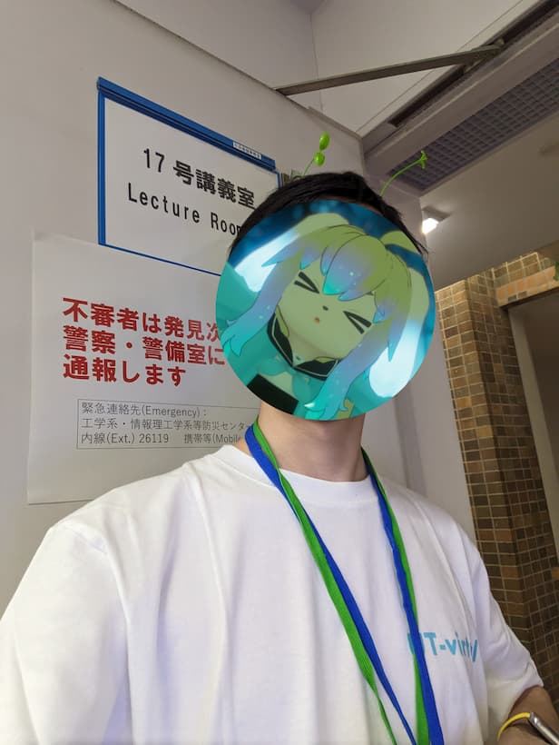
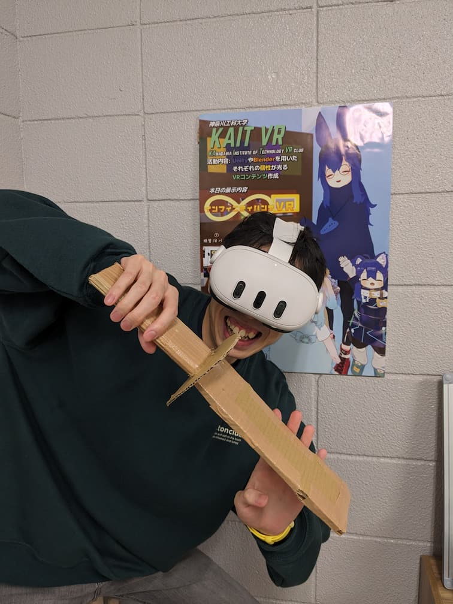
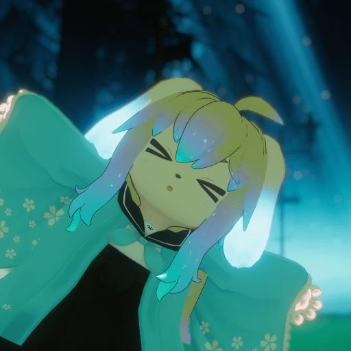
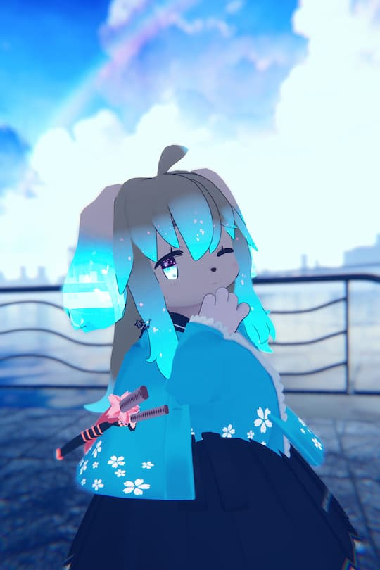
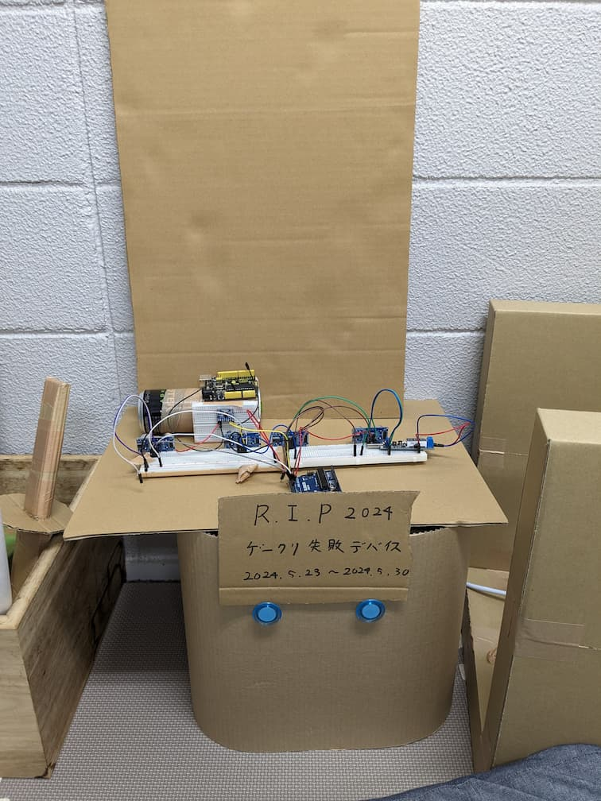

## はじめに
はじめまして、KAIT VRで2年間運営し、UT-virtualで一年運営していました

__**twilight_noly**__

と申します！

NUMAという団体に参加して

**この団体はすべてのサークルが入っていてほしい**

と感じたので、それを記事にしてしまおうってわけです

||||
|---|---|---|
|UT-virtualの姿|KAIT VRの姿|VRChatの姿|

## なぜそう思った？前提からGO
私は前述の通り、KAIT VRで運営を2年してきました。

同じ組織で運営している仲間が居ても、違う組織で運営している仲間というのは

なかなかに少ないものです。

やはり違う仲間と互いの組織の運営方法など話し合い

知見を共有するのは、すごく理にかなっていると思っていました。

その中、現れたのは __**NUMA(全日本大学メタバース連盟)**__ でした。

|閑話休題||
|---|---|
|||
|かわいいですね| |

## NUMAの魅力
 __**NUMA**__  には様々なサークルの運営のみんなが集まっています

運営するうえで、自分の手法は間違っているのかいい方向に向かっているのか

すごく不安になることが多々あります

同じ志を持つ仲間たちと話し合い、互いを褒め合いたい

そんなふうに感じることもあります

そんなときに頼りになるのが

 __**NUMA**__ でした

様々なサークルの人と交流でき、様々なサークルで違う

様々な文化を知り、サークルの発展がより加速度的に感じられました

これからもサークルの後輩たちに使ってほしいなと思いました

**まじで使え、後輩たちよ...**

**そして、日本地図をNUMA色に染め上げよう！**

|閑話休題||
|---|---|
|||
|KAIT VR部室内に建てられたプロジェクトの墓| |

## さいごに

さて、拙い言葉で少ない文量しかかけない私ですが

伝えたいことや書きたいことは以上ですかね

私自身、全国のメタバースサークルを集めて

全国の人と仲良くしたい、後輩ちゃんたちにもしてほしいと思っているので

これからもNUMAの活動を頑張っていきたいなと思います！

読んでくださりありがとうございました

*twlight_noly*