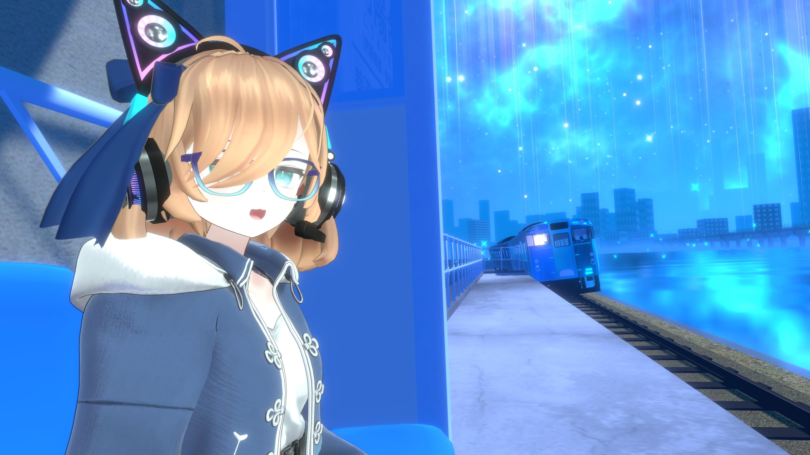
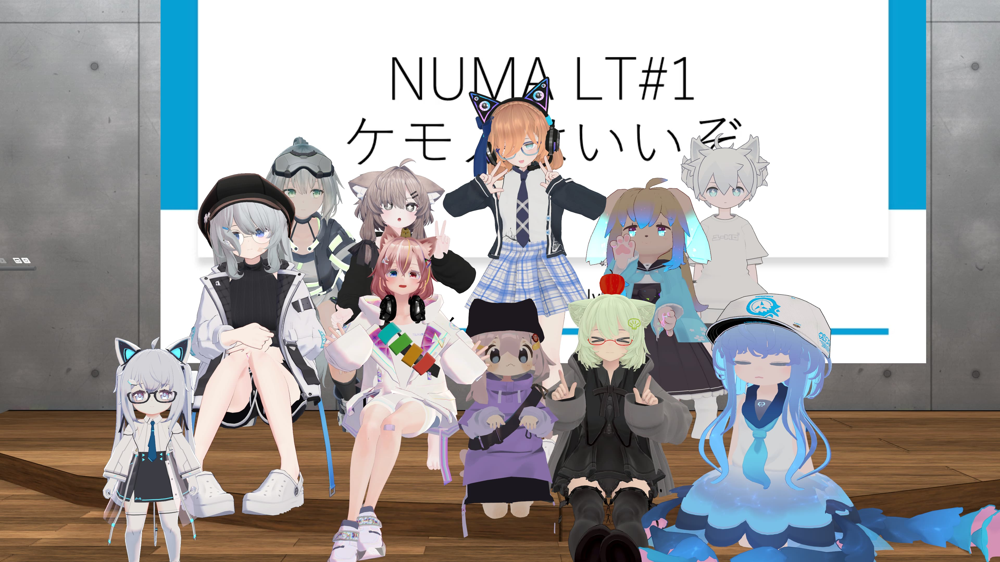
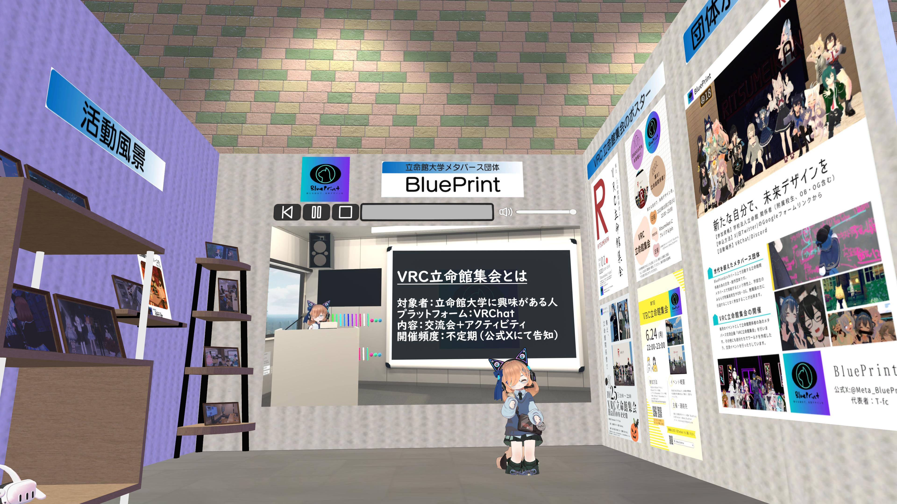

この記事は，NUMAミニ・アドベントカレンダー企画の記事です．

サークルの団体紹介を書くと良いと聞いたので書いてみた記事です．
# 書いてる人の紹介
まずは，自己紹介からということで…  
昨年度まで，立命館大学メタバース団体BluePrint代表してたT-fcです．  

 
執筆時点で4回生なので，この記事を書いているときは絶賛卒論・学会論文の執筆でやばいと叫んでる状態です…

NUMAとの関わりはBluePrintとしても，運営ポジション（会計だったかな）としても関わりがある感じでしたね～  
普段VRChatでは，映像制作とかYouTubeでの配信，イベントスタッフなど色々やってる人です．  
懐かしい写真が見つかったのでここに残しておこう...  
（NUMAになってから初めて開催したLT会の写真）

 

# BluePrintとは

 
ここからは，私が代表として活動していたBluePrintの紹介をしていきます．  
BluePrintとは立命館大学の関係者（学生・OBOG・附属校生・教職員）の集まりで，主にVRC立命館集会の主催をしています．（最近開けてないのはごめんね） 

 

2022年7月20日に団体Discordサーバーが設立され，翌日に団体名が「BluePrint」に決まり，そこから立命館集会や交流会企画，メタバース体験会，部誌頒布などを実施してきました．  
初代代表は水瀬ゆずで，団体ビジョン「新たな自分で，未来デザインを」と定めてから，2代目代表Haya10，3代目代表T-fcと続き，現在の4代目代表はRuCM_218oと続いています．  
昨年は，校友会未来人財育成奨励金受給団体として，BKCウェルカムデー，OIC学園祭に出展し，メタバース体験会の開催や，Virtual Marketへの出展等行ってきました．

 

 

NUMAをはじめ，JVSLさん，株式会社ゆずプラス，立命館大学の教授の方など，なんだかんだで様々な人と繋がりが多い団体となっています．
（去年めっちゃ頑張った...）

# おわりに
ということで，BluePrintとはどんな団体か超ざっくり説明してきました．  
もっと書けるだろと言われそうですが，ほぼOBみたいな人が書くのも...ということで控えめです．（今年の活動が少なめだったのも要因の一つ）  
今後の活動については公式X（旧Twitter）にて告知予定なので，興味がある方はぜひBluePrint公式X（旧Twitter）をフォローしていただければと思います．  
入会フォームも載せておきますので，立命館大学関係者の方で興味があればフォームにて応募していただければと思います．

- [BluePrint公式X（旧Twitter）](https://x.com/Meta_BluePrint)
- [BluePrint入会フォーム](https://docs.google.com/forms/d/e/1FAIpQLSeY0rEmk83EvJxqbBMHYGzoDHqbJ1o9uiHICzHkmFH6oTV7yg/viewform?usp=send_form)

それでは，またどこかでお会いしましょう～！