# HIT Metaverseとは？

HIT Metaverseは広島工業大学にあるメタバースサークルです。
2022年の夏に発足されて、現在では部員が約50人のサークルになっています。
<b>「人とのつながりを大切にする」</b>という、 理念のもと活動を行ってきました。

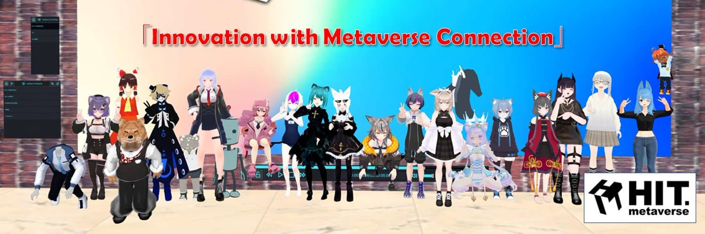

---

# 活動報告
では実際に2025年に行ってきた活動を報告します。

---

## 4月 新入生歓迎会
4月には新入生歓迎会を行いました。
今年は12人のかたがサークルに入部しました。
内容としては、学校ではVR体験会を行い、VRの楽しさを知ってもらいました。
また、メタバース側では初心者案内を行い、メタバース内でできることや、楽しみ方などを説明しました。
新入部員のメンバーがメタバースに興味を持ってもらう良い機会になったと思います。

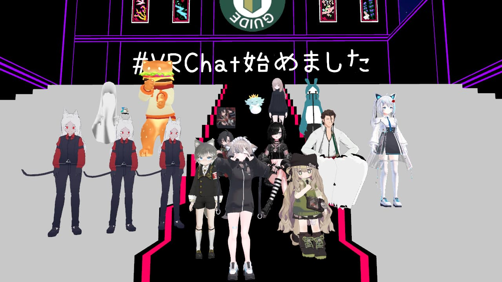
初心者案内の様子
 

---

## 6-8月 Virtual Open Campus
Virtual Open Campusとは、
広島工業大学で8月9日、10日に行われるオープンキャンパスを盛り上げるため、HIT Metaverseで、1部のブースをお借りして、活動を行います。
それと同時にClusterを使い、広島工業大学に遠くて来れない人向けに、
メタバース上で大学を再現したワールドを使い、オープンキャンパスを行う活動をしています。
HIT Metaverseでは、6月から8月の２か月をかけて、準備を行いました。
その結果、当日には2日間で400人ほどの方に参加していただきました。
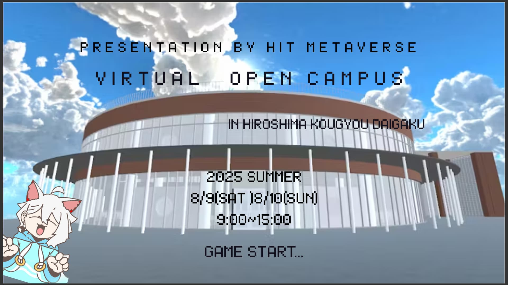
### VOCの活動内容紹介
では具体的にどのような活動を行ってきたか紹介します。

---

#### VR体験会
VR体験会では、自分たちで作ったワールドを使い、VRChatで遊ぶ体験と、beat saberで遊ぶ体験の2つを行いました。

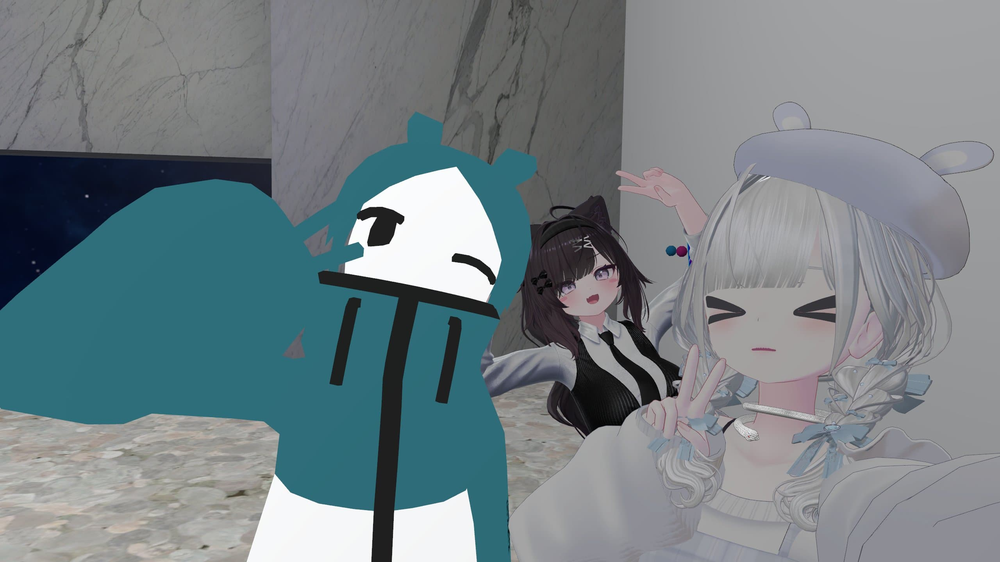
体験会の様子 with VRChat 

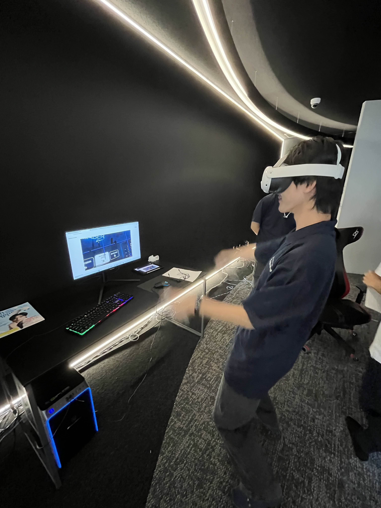
体験会の様子 with Real 

---

#### バチャゲート
バチャゲートでは、リアルではバーチャルの様子が、バーチャルでは、リアルの様子がモニターごしに、見ることができます。
また、リアルでアピールをすると、バーチャルの人たちが返してくれるといった体験を提供することができました。

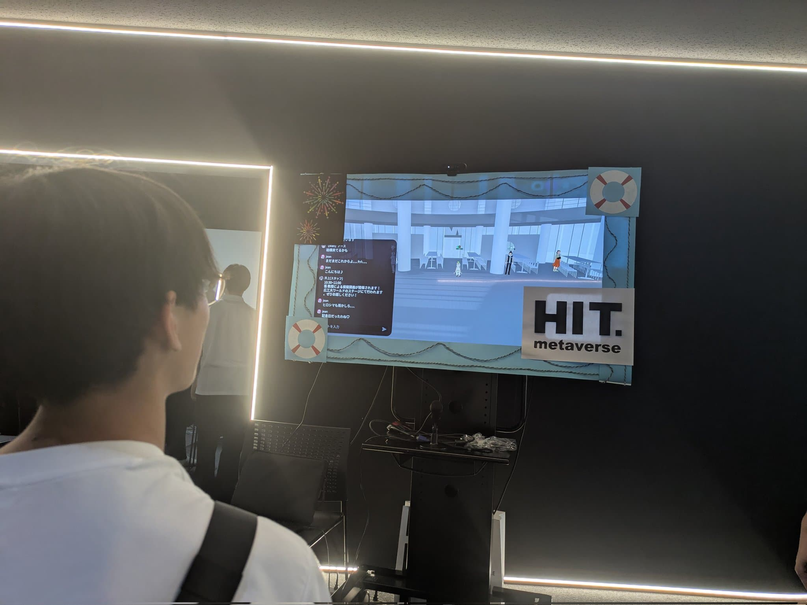
リアルから見たバーチャルの様子 

---

#### バーチャル学校案内
バーチャル学校案内では、
実際の建物を再現したワールドでパネルを用いて、サークルのメンバーが説明をするといった活動を行いました。
現地に行かなくても、実際に通っている学生から、メタバースを通してお話を聞ける場を提供しました。

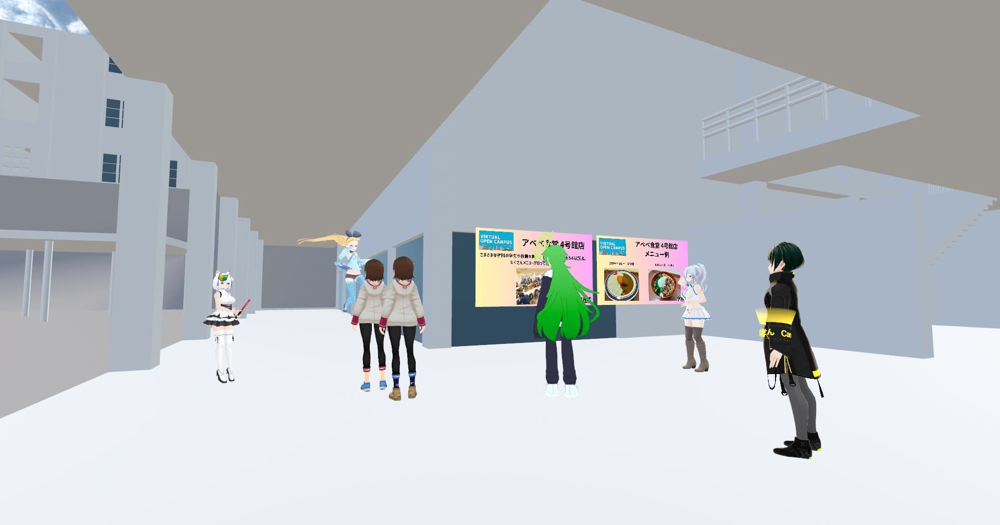
学校案内の様子 

---

#### ステージ企画
ステージ企画ではメタバース上で、ステージを作成し、そこで企画を行いました。
今年は、動画を用いた先生による模擬授業、広島工業大学についてのクイズ大会を行いました。

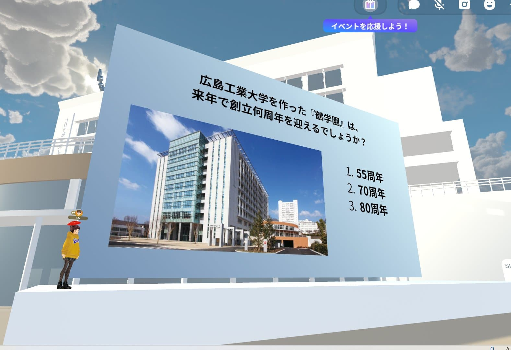
クイズ大会の様子 

---

## 10月 Hiroshima Digital Meet up
TSS様にお呼びしていただき、**Hiroshima Digital Meet up**という、メタバース上で企業様に活動をアピールするイベントに参加しました。
その際、HIT Metaverseは、広島工業大学を再現したワールドを展示しました。広島の企業様に活動を知ってもらういい機会になりました。

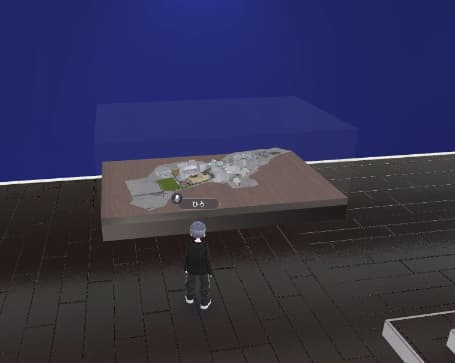
実際に展示したもの 

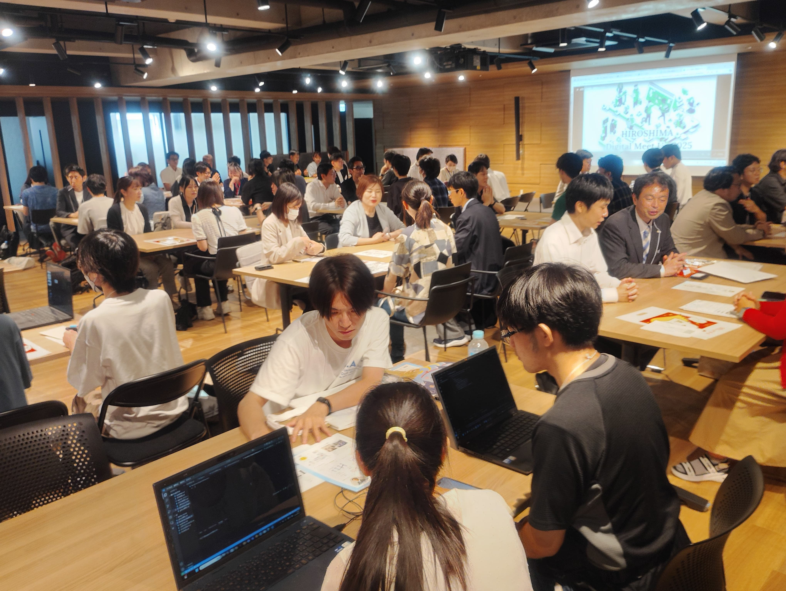
企業様とのオフでの交流の様子 

---

## 11月 広大祭
11月1日と2日には広大祭でVR体験会を行いました。2日間で約100名ほどの方に体験していただきました。
オープンキャンパスに比べて、 小学生や幼稚園児といった、小さい子供たちが体験に来てくださいました。

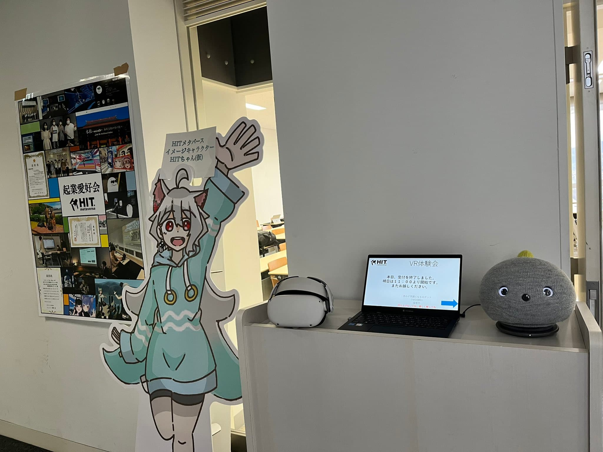
実際の会場の様子 

---

## その他　定期交流会
そのほかにも毎週、サークル内で定期交流会を行っています。
内容はゲームワールドで遊んだり、綺麗なワールドで写真を撮ったり、お部屋のワールドで雑談をしたりしています。

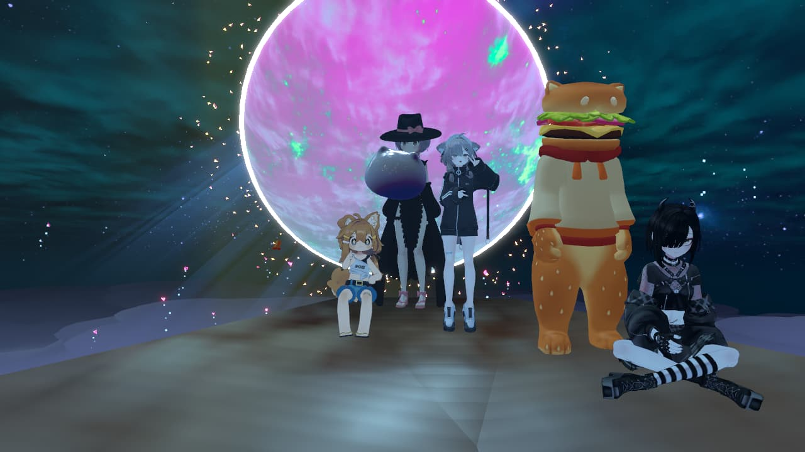
交流会の様子 

---

# おわりに
ここまで読んでくださりありがとうございます！
来年度は部長を交代して活動を行っていきますが、活動を継続して行っていく予定です。
よろしくお願いします！

<a href="https://x.com/HIT_Metaverse">HIT MetaverseのX (旧Twitter)はこちら</a>