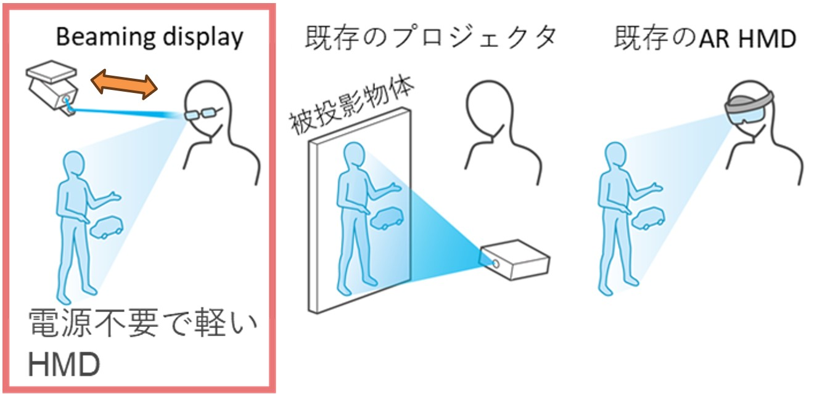
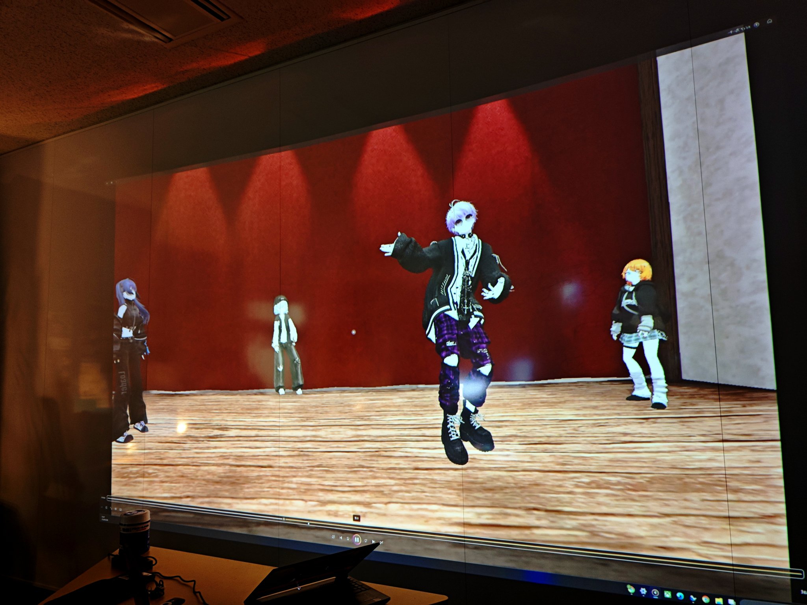
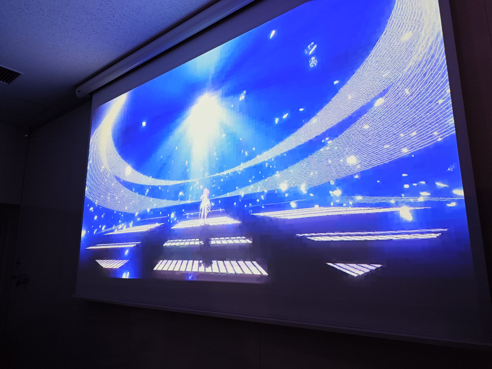
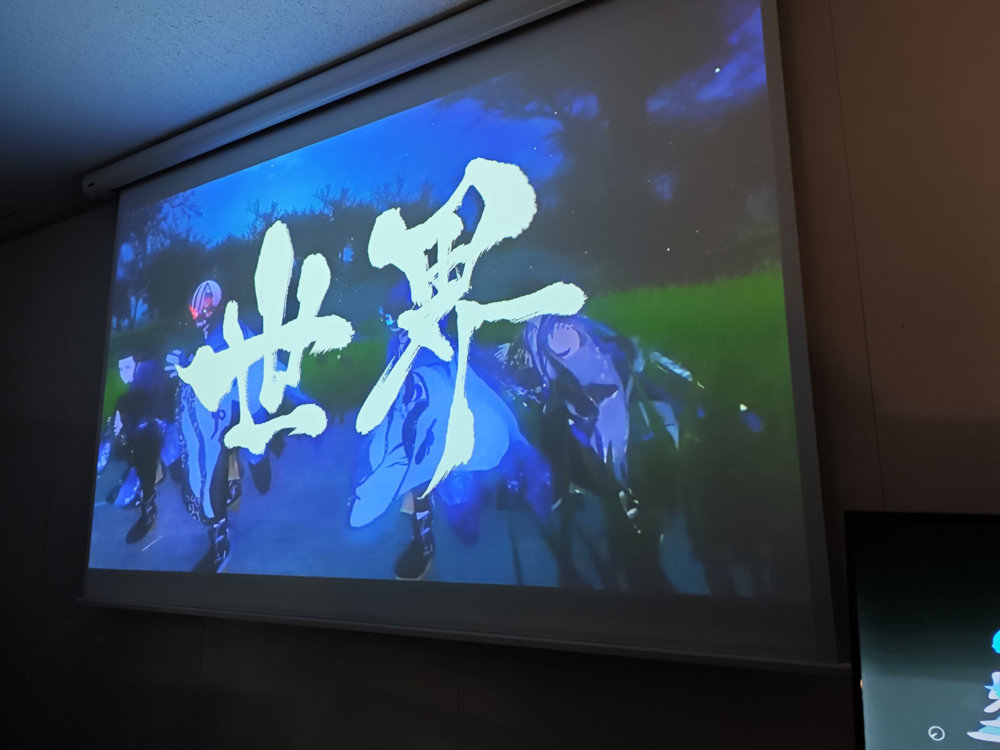
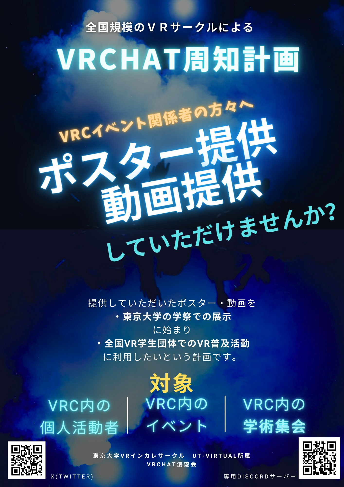

---

title: "Numaで東大研究室見学！全国の大学サークルからねらう一般層へのVRC周知"
date: 2025-12-13T23:09:43+09:00
categories: ["Blog"]
author: "Uni_Uni"
tags: ["NUMA", "活動記録", "イベント開催", "VRChat", "研究室見学"]
description: NUMAによる研究室見学とVRChat周知企画の活動記録

---

## はじめに

こんにちは、Uni_Uniです。

この記事では、NUMAの活動の一環として実施した

* **東京大学 暦本研究室（Rekimoto Lab）の研究室見学**
* **VRChat 周知企画（通称：メタバース放送局）**

の2つの取り組みについてご紹介していきます！

アカデミックの最前線から、メタバースの周知活動まで。
NUMAだからこそできた、とても密度の濃い活動になりました。

---

## 東京大学 暦本研究室 見学

今回の研究室見学は、SVRC と UTv の合同企画としてNumaつながりで実施し、
**合計12名** で東京大学の **暦本研究室（Rekimoto Lab）** を訪問しました。

### 目玉は Beaming Display
##### Beaming Display （参考）

> **参考文献：** Y. Itoh et al., "Slim Diffractive Waveguide Glasses for Beaming Displays with Enhanced Head Orientation Tolerance," *IEEE VR 2025*.

見学の大きな目的は、近年話題となっている **Beaming Display（BD）** を
実際に体験させていただくことでした。

Beaming Display は、

* 映像生成を環境側で行い
* ARメガネ側は「投影されるだけ」

という設計思想によって、
**ARメガネの大幅な軽量化**を実現する方式です。

専用プロジェクターと高精度なトラッキングによるデモでは、
頭を動かした瞬間にピタッと映像が追従し、
その追跡速度と安定感に参加者全員が思わず声を上げていました。

「これは実際に見ないと分からない」

まさにそんな体験でした！

---

### 光学・素材・思想まで含めた深いお話

BDの紹介にとどまらず、見学では非常に幅広いテーマについて教えていただきました。

* 回折光学の基礎と、実際の応用例
* **ホログラムとは何か**という、技術だけでなく思想としての厳密な定義
* BD以外の最新投影技術
* ARメガネに使われる興味深いマテリアルの実物展示

  * 異常に高い熱伝導性を持つ素材
  * さまざまな種類の回折格子

さらに、

* 現在のARメガネが直面している限界
* それを乗り越えるための色調・明度制御の重要性

といった点まで、包括的に解説していただきました。

### メタバース内での行動理解研究

また、Cluster 環境を用いた Agent 実験や、
**メタバース内での人間の行動理解**に関する研究についても紹介していただきました。

現実世界とは異なる制約・自由度を持つメタバース空間で、
人がどのように行動し、関係性を築くのか。

VRChat などに日常的に触れている私たちにとっても、
非常に興味深い内容でした～！

---

結果として、見学は **約4時間** にも及び、
終始「情報量が多すぎる！」という嬉しい悲鳴の連続でした。

参加した部員それぞれが、
アカデミックへの好奇心を大きく刺激される、
本当に大満足な研究室見学になりました。

---

## VRChat 周知企画：メタバース放送局

### 企画のきっかけ

この企画は、
**東京大学 五月祭で、全国初となる VRChat 専用企画を立ち上げる**
という構想から始まりました。

狙いはシンプルで、

* VRChatという文化・世界観を
* 大学生の立場から、一般層に分かりやすく伝える

というものです。

---

### ポスター・記事・日記の展示

まず第一段階として、VRChat内のイベントやコミュニティを回り、
企画内で展示する **ポスター募集** を行いました。

その結果、

* **60以上の団体** からポスターを提出いただき
* その中から **20以上の団体** に、さらにレポート形式の記事にも参加していただきました
* また、個人でVRC活動日記を書いている方からは、
  **約20枚** にわたるVRC日記を展示させていただきました

また、各イベントの **活動・PR動画** についても、
企画会場内で常時投影を行いました。

---

### パフォーマンス企画

会場内にはパフォーマンス枠も設け、

* ダンス
* 演舞
* パーティクルライブ

といったジャンルで、**全4団体** に個別にご協力いただきました。

それぞれの団体が、
それぞれの形でパフォーマンスを披露してくださり、
ライブ・収録の両形式で実施しました。

パフォーマンスは一般来場者にとって非常にインパクトが強く、
多くの会話や興味のきっかけを生み出してくれました。

協力してくださったすべてのパフォーマーの皆さんに、
心から感謝しています。

---

## メタバースアーカイブとVRC体験

企画全体では、

* メタバースアーカイブ展示
* 動画投影
* VRChat体験コーナー

を中心に構成しました。

### メタバースアーカイブ

アーカイブ展示は、
多くのイベント関係者・個人活動者の協力によって成り立っています。

これらは、

* 全国の学生VR団体が
* 低コストで再利用できること

を目的として制作されたものです。

実際に、今秋にはNUMA内で再利用されており、
今後も **さまざまな全国の学生VR団体** へ広がっていくことを目指しています！！

---

### VRChat体験

VRChat体験コーナーでは、
VR内のアテンド役として、NUMAから全国各地の部員が参加してくれました。

距離を隔てた多くの大学生が一緒に活動できたのは、
**VRChat と NUMA の両方があったからこそ**です。

---

## おわりに

研究室見学とVRChat周知企画を通して、
改めて感じたのは、

* メタバースのスケールの大きさ
* その中で生まれる自由さ
* そして、人と人が自然につながっていく力

でした。

アカデミックな最前線に触れ、
全国の学生や活動者と協力し、
現実とメタバースを行き来する中で、

「こんなに自由で、こんなに広い世界があるんだ」

という感覚が、
参加した全員にしっかり伝わってくれたと思います。

NUMAという場があったからこそ実現できた今回の活動。
これからもこの勢いのまま、
学びも遊びも本気で楽しみながら、
メタバースの可能性を広げていけたら嬉しいです。

読んでいただき、ありがとうございました！

著者：Uni_Uni
---