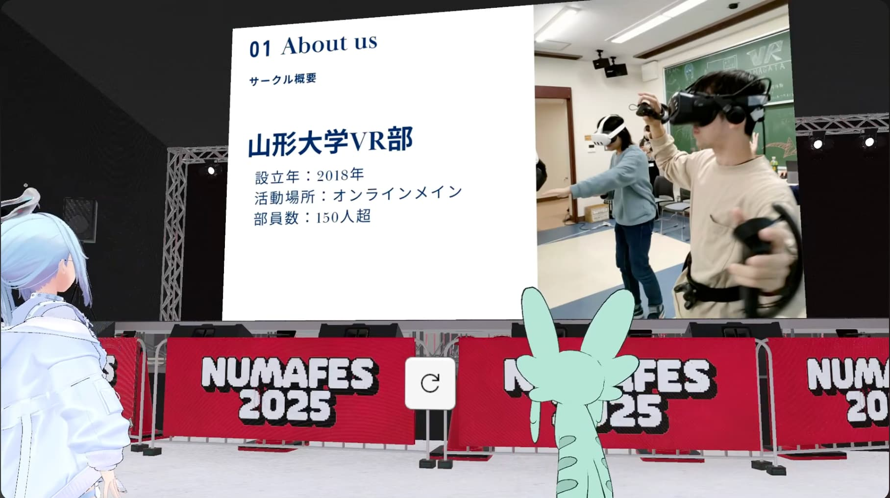

# UT-virtual×山形大学VR部対談 -前編-

最大規模のVRサークル山形大学VR部と東京大学のVRサークルUT-virtualの対談が開催されました！

運営に関するアレコレから野望まで！ぜひご覧ください！

**YouTube動画版：**

https://www.youtube.com/watch?v=J5_YUFp_Q84&list=LL

**対談者**

**まーしゅ**　- 2025年度山形大学VR部副代表

**まっしろた**　- 2025年度UT-virtual代表

---

## VR部の紹介

**まーしゅ：**拙いスライドですけど……。後ほどUTvからも紹介があると思いますが、UTvよりも一年若くて、今年で8年目になります。アクティブメンバーは80人ぐらいで、discordに加入しているのが200人ぐらいになります。ただ、今年は私中心に新歓を頑張りまして、結構新入生が入ってきたかなと。OBの方々を整理しつつ60人ぐらい入ってきたので、150〜200人とレンジがあります。

**まっしろた：**すごいな、150人か。

**まーしゅ：**うちは他のVRサークルに比べると、コミュニティ感が強いというか。あまりゴリゴリに開発をしているというわけではありませんが、ゲームを制作するチームだったりとか楽曲を制作するチームもいます。「VR」といいつつ、VRに関連したようなデジタル技術を扱うような感じですね。

**まっしろた：**広く、クリエイティブな活動なんですね。

**まーしゅ：**そうですね。VR部の仕組みとしてはみんながぐちゃぐちゃになってやっているわけではなくて、「プロジェクト」という形でグループ分けがされてて。Unity触っている人たち、blender触っている人たち、あとは楽曲制作する人たち。あとは他のVRサークルにはありませんが、e-Sportsをやっている人たちもいますね。

**まっしろた：**すごい。VRだけじゃないんだ。

**まーしゅ：**そうですね。まあ、そんな感じで笑。

**まっしろた：**すごい、ずいぶんさくっといったけど大丈夫かな？笑。

**まーしゅ：**深掘りはまっしろたさんがしてくれるでしょう笑。

**まっしろた：**ええ……。150人いるけどしっかり統率取れてるのすごいな。簡単にバラバラになっちゃいそうだけど、うまく活動が図られてるのすごいなって思う。

**まーしゅ：**大きいコミュニティの中に小さいコミュニティが何個もある感じなので、大きいコミュニティの帰属意識っていうものは薄いかもしれないんですけど、小さなコミュニティへの帰属意識っていうのはみんなそれぞれ持ってるのかなと思っていて。

**まっしろた：**なんか、コミュニティ間の交流とかってあったりするの？

**まーしゅ：**ここが……課題ですよね。まあ、オフラインイベントを頻繁にやったりだとか、今週末（当時）にありますけど、文化祭だったりとかで大きめの企画を用意したりして交流を図ろうとしています。

**まっしろた：**なるほど。まーしゅさんはどこに所属しているんですか？

**まーしゅ：**そうですね……。結構開発っていうよりかは、サークル内のマネジメントをすることが多いので、どこに所属しているというわけではないんですけれど、まあ主にVRChatでワイワイするコミュニティでぶいちゃを回ったりしている感じですね。

**まっしろた：**e-Sportsって例えば大会に出たりとかは……？

**まーしゅ：**ああ！実は一度出てるんですよ。この前、東日本の大学のe-Sports連盟みたいな、学生が主体でやっているところがあるんですけれど、それに招待されて。VALORANTっていう銃を撃つゲームで、詳しい結果まではわからないんですけど。普段はコミュニティ感が強いというか、ガチになって競技的にやる感じではないので、どうなのかなって思っていたんですけれど。意外とそういう方が良かったりするかもしれませんね。

**まっしろた：**純粋に楽しいと思える人で集まれているのがいいのかもしれない。あと個人的に気になったのはTRPG？本当にTRPGやっているの？

**まーしゅ：**ここがですね、僕が唯一入り込めていない領域でして。いまいち分からないところもありますが、週に一回から二回集まってやっているみたいですよ。新歓とかでも結構人気があって、ブースも人が来てて。VRに興味はないけどTRPGに興味があるっていう人が一定数いますね。

**まっしろた：**VR部なのに……？笑

**まーしゅ：**いやー、そうですね。例えばUnityやっている人に「今度ボードゲームみたいなの作ってみない？」って振って、その監修をTRPGの人がやるみたいなのでいい感じにクロスさせられたらなぁと思っています。一応サークルの理念として、「VRをはじめとするデジタル技術の啓蒙、普及」っていうのを掲げているので、できればどのプロジェクトたちもそのような活動ができればいいなと思いますね。

**まっしろた：**なるほど。じゃあ、VR関連の話を聞こうかな。最近のVRの活動はどうですか？例えば「純粋にぶいちゃで遊んだ」でもいいし、「大会出た」とかでも。

**まーしゅ：**そうですね。うちはどちらかというとコンテストとかVketとかに出たりするような感じではないので、個人個人でその分野に強い人が出るといった感じで。ただ、主にぶいちゃをやるコミュニティの事実上の運営権を移行をしまして。そうしたらその運営権を渡した子がめちゃめちゃアクティブで。先日UTvとも交流会させてもらいましたが、その企画を立てたのもその子で。

**まっしろた：**めっちゃいい人。

**まーしゅ：**僕はサークル運営を長く続けていきたいなという思いがあるので、いかに自分がいなくても、マネジメントする人がいなくてもやれていけるかというのを考えてしまうんですけれども。その子は猪突猛進みたいな感じで、「みんなとぶいちゃしたい」みたいな。

**まっしろた：**純粋な熱量があるんだ。

**まーしゅ：**そうですね。そういう子が今後サークルを引っ張っていくのかなぁと密かに期待しています。

---

## UT-virtualの紹介

**まっしろた：**2017年設立。今大体100人ぐらいですね。アクティブメンバーは3,40人。そのうちの三分の一が運営で、三分の一がIVRCとかの学術系、残りが遊ぶ人みたいな感じかな。インカレなので全国から人が集まってきてくれてます。活動場所が基本的にオンラインになっちゃうって感じで、あとはちょこちょこ外で遊ぶことがあるって感じですね。今やっている活動としては、年二回の文化祭と、漫遊会っていうVRChatで遊ぶ人たちがいるところと、学術系をやっている人がいるのと、あと運営がいるって感じです。

**まっしろた：**次のスライドです。「UTvで何ができる？」ということで、技術・遊び・学びの三つを押し出していきたいなと。UTvの強み。まず人脈・協賛。知名度があるというのと、OBの方々がVRのいいところに行っているということ。土地柄もあります。そして活動資金ですね。入会費と協賛様からの資金で潤沢な活動ができています。

**まっしろた：**まず、運営から活動へ資金援助を行う。そしてその活動を企業さまなどにみてもらって認めてもらう。そんなサイクルを目指していきたいなと。そんなサークルでした。

**まーしゅ：**やっぱり自分がサークル運営している以上、一番気になるのは運営のところで。アクティブメンバーの三分の一が運営っていうのは他のVRサークルにはないかなと思ってて。うちのサークルももっと少ない。やっぱりこういうサークル入ってくる人っていうのは、自分が開発したいとかこういうのを作りたいと思って入ってくれる人たちが多いから、そんな中でしっかりと運営メンバーを確保できるっていうことは他のサークルにはないUTvの強みなのかなと。

**まっしろた：**運営メンバーは、もうdiscordで直近2ヶ月以内に見かけた人みんなをスカウトしたみたいな笑。だから、適材適所とか言ってる暇もなかったね。

**まーしゅ：**うんうん笑。

**まっしろた：**そもそもそんなに関わったことがなかった人もいたし。だけど背に腹は代えられぬってことで。「はじめまして、UTvのまっしろたと言います」からはじめて。「今年の代表することになりました。協力してくれませんか？」ってDMしにいった。

**まーしゅ：**二言目には運営の相談笑。

**まっしろた：**やっぱり運営するのにはそれは必要だね。今も別件で動いていて、めちゃくちゃ凡ミスしまくっているけど、それを救ってくれる人がいなくて。情報が違うんですがって問い合わせがめちゃくちゃきてる。それを確認してくれる人もいない。やっぱり人手は必要だね。ちなみに運営は何人ぐらいですか？

**まーしゅ：**いやでも、10人ぐらいじゃないかな。ただ、運営ロールが振られているだけで、有事の時には手助けしてくれるけど、あまり運営には関わっていない人がほとんどだから。事実上、代表と副代表と2人ぐらいで回しているかな。

**まっしろた：**10人ぐらいいればね。うちも12人ぐらいだし。

**まーしゅ：**まあそんなに苦労していないなぁって点では、みんなが小さいコミュニティごとに活動しているから、その小さいコミュニティのリーダーの人たちが頑張っている。運営は文化祭などの全体が関わるイベントの時しか動かないみたいな。あとは渉外とかで人が割かれているぐらいで。意外とタスク的なものはないなぁと。

**まっしろた：**いいなぁ。必要な時に集まってかなりいい感じに団体が回っている感じじゃない？

**まーしゅ：**ただまぁ、運営陣の高齢化が進んでいますから。有事の時には経験則でわかっている人たちが来てくれるって感じで。

**まっしろた：**下の世代に「運営志望です」って言って積極的に関わってくれる人いないの？

**まーしゅ：**あんまりかなぁ。そこがやっぱり課題だね。

**まっしろた：**なかなかいないもんね。VR部に運営志望で入ってくれる人は。

**まーしゅ：**いるわけないんだけどね笑。そういうことするサークルに行ってらっしゃいって感じになるので笑。

**まっしろた：**そういう子がいるとね、代表やってって気軽に言えるけど。だからね、どう引き継いでいくかなんだよね。なんか引き継ぎ文書の作成も自分たちでやってるの？それとももう数年は引き継がない感じですか？

**まーしゅ：**いや、もうやばいんですよ。今メインで回しているのがM1とB3なんだよね笑。

**まっしろた：**おお、M1とB3……。

**まーしゅ：**いなくなるやん笑。来年消えちゃうんだよね。だから、少なくとも今年度末に代表は替わると思うし、そのタイミングで引き継ぎもしていかなきゃならないと思っている感じ。UTvって引き継ぎどうしているのかな、気になる。

**まっしろた：**引き継ぎは、歴代の運営人が残した文書アプリを使ってどんどん引き継いでいく感じかな。あとは、運営会を毎週開いているんだけど、そこもテキストベースでやっている。ちゃんと議事録残しているから、過去の人がどんなことやったのかを気軽に見れる。逆になんか引き継ぎのイメージとかできている？こっちも試行錯誤してるからいろんな話を聞きたいかも。

**まーしゅ：**渉外的なところは現場に足を運ばせるのが大事だと思っていて。たまに企業様とやりとりしたいみたいな人がいて、そういう人は自分と一緒に連れて行ったりするけれども。でもそうじゃなくて、実際の運営の内部的な引き継ぎは、ちょっと未知数すぎるんだよね。というのも今の代表が、サークル8年目なのに二代目なんだよね。前代表がカリスマ性高すぎて5、6年務めて、そして昨年Gillbroさんという方が新たに代表になって、僕らも何したらいいか分からないという。

**まーしゅ：**年数で見ると8年でUTvと同じくらいだけど、運営的なところを見たらまだ出来立てホヤホヤみたいな。そのギャップが生まれているのが課題かなと。

**まっしろた：**だって代替わり二回目でしょ？

**まーしゅ：**まあ中の運営メンバーはちょこちょこ変わりつつも、トップが変わったのが一回目だからね。

**まっしろた：**まあ自分が思うところでは、代表の理想とするところがサークルに表れるわけで。会計とか渉外とかシリアスなところを除いては好きにやっちゃっていいんじゃないかなと思うね。例えばこんなイベントやりたいんだけどって代表が主導すればそれに乗っかればいいし。逆に代表が渉外を強めて企業様からお金をいただいて活動を活発化させたいって言えば、それに乗っかればいいし。その代表さんの個性が出るって感じだから。

**まっしろた：**山大ってお金の管理とかどんな感じなんですか？

**まーしゅ：**うちはUTvと違って年会費をとってないから、大学から活動費として渡されているお金と、案件やVR体験会のときにいただいたお金を運営資金に回すみたいな。

**まっしろた：**そうなると協賛じゃないからそんなに重く捉える必要はないんじゃないかな。あとは土台が盤石だから運営がコロっと変わっただけではそんなに変わらないのかなとも思った。ちなみに次の代表候補は決まってたり？

**まーしゅ：**いやー……まだかなぁ。気づいたら押し付けられそうで若干怖いけど、自分としては今のポジションに満足してるから。サークルの顔的なところは代表に押し付けつつ、NUMAの活動のようなことができるからいいかなと思ってる。

**まっしろた：** うらやましい笑。

**まーしゅ：** そうか笑。自分の人生経験的に二番手、三番手に立つ方が得意だったりするから、結構気に入ってる。

**まっしろた：** そうなんだ。でもねぇ、トップから見るとさんざん遊ばせてやったんだから次は運営入って頑張れって言いたい笑。

**まーしゅ：** ははは！

**まっしろた：** まあ、自分も若干冗談で言ったところもあるし、本音では思ってないんだけれど笑。一生学術方面を頑張っている人がいて、その人の活動を邪魔したいわけじゃないけど、今まで資金提供してきたから多少運営に関わってもいいんじゃないの？とは言いたい気もする。

**まーしゅ：** まあ、サークル運営ってボランティアで助け合いだから。そこは痛感するよね。さっき有事の際に助けてくれるみたいな話があったけど、これがいつも10人とかでやっていたらもっとサークルが良くなるんじゃないかと思うんだよね。かと言って強制もできないし、難しいところ。

**まっしろた：** メンバー固定してないと柔軟性があって有事にも対応しやすいかもね。

---

**続きは後編で！**

**後編：**

**YouTube動画版：**

https://www.youtube.com/watch?v=J5_YUFp_Q84&list=LL