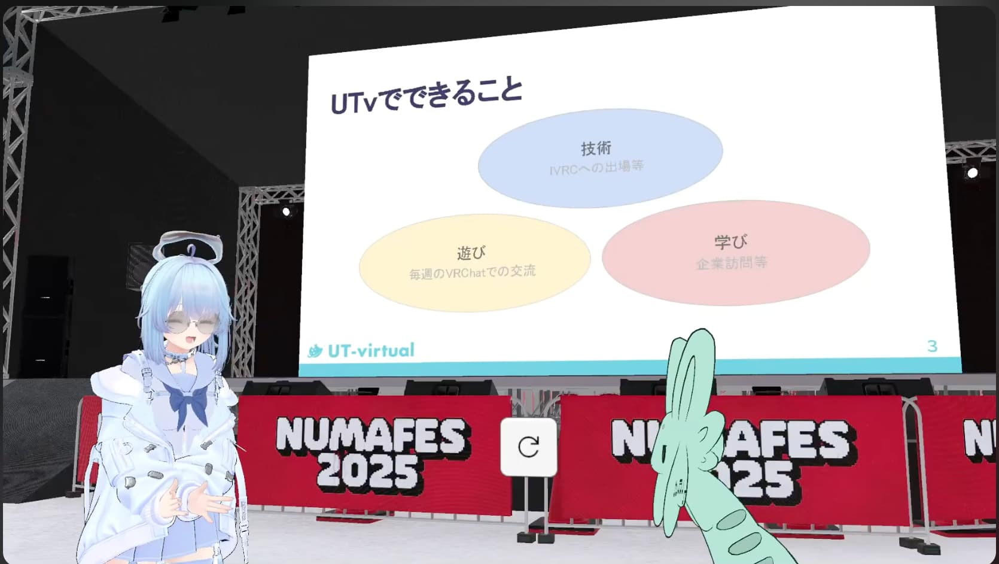

最大規模のVRサークル山形大学VR部と東京大学のVRサークルUT-virtualの対談が開催されました！

運営に関するアレコレから野望まで！後半はもっと掘り下げていきます。

**YouTube動画版：**

https://www.youtube.com/watch?v=J5_YUFp_Q84&list=LL

**対談前編：**

https://numa-meta.com/posts/blogs/circle-taidan-01-part1/

**対談者**

**まーしゅ**　- 2025年度山形大学VR部副代表

**まっしろた**　- 2025年度UT-virtual代表

---

## サークルについて深掘り

**まっしろた：** じゃああれなんだね。聞いてる感じだと会計担当、渉外担当、広報担当、イベント担当って決まってるわけじゃないんだ。

**まーしゅ：** そうなんだよね。代表、副代表だけ決まってて、他は運営メンバーがこの案件は私が、この案件はあなたがという感じに上手くやってる感じかな。あ、会計担当はいるか。ただ、渉外担当とか広報担当とかは決まってないかも。

**まっしろた：** いいな。自発的に人が集まってくれるのってカリスマなんじゃない？

**まーしゅ：** ええ、どうなんだろう。

**まっしろた：** でも、サークル構成員の「好き」を表現できる場所が用意されてるのって強みだと思うし、そこを表に出していかないとね。

**まーしゅ：** 最近そのちっちゃいコミュニティの中でVR部がどうなっているのか知りたいって子がいて、自分たちの所属しているちっちゃいコミュニティじゃなくてVR部全体にも目を向けてくれる子たちが一人二人と出てきてて。最初はサークル運営じゃなくて、まずはちっちゃいコミュニティの運営を頑張ってもらって、全体の運営をするような人が今後も出てくるのかなぁって。そういう子達が今後のサークル運営を担ってくれればなぁって思ってる。

**まっしろた：** まあでも、聞いてる感じサークル運営やりたいですって簡単に名乗り出てくれそうだから大丈夫じゃないかな。

**まーしゅ：** 200人もいるからね。名乗り出てもらわないと困るんだけどね。でも理想としてはUTvのように毎年運営メンバーが切り替わる、新陳代謝が起きるっていうのがサークルとしてはいいと思うんだよね。

**まっしろた：** そこはね、自分も入った時にはすでにあった風習だから。実際いい仕組みだから続けていくつもりではあるけど。そうそう一年じゃ変わらないから、その一歩目をどれだけしっかり踏み出せるかっていうのは大事かもしれない。

**まっしろた：** なんか、引き継ぎ文書の管理とかって今どうしてる？

**まーしゅ：** そうね、一応Notionで管理はしているんだけど、一部の運営メンバーが使いこなしている感があって。部の情報がまとまってて、これを見ればわかるんだっていうのをみんな理解してくれれば、みんながデータを有効活用してくれればいいなっていうのはあるんだけど。文化祭担当に任命されましたってときに、すでにあるデータを見るんじゃなくて新たにやり取りを始めるということが起こりがちな気がするんだよね。

**まーしゅ：** そういうところを、対応マニュアルみたいなのが出来上がってて、それを見ればわかりますって状況にしたいんだけど。そういうことに最近気づき始めて、運営マニュアルみたいなのを作ってる最中ではあるんだけど。

**まーしゅ：** ちょうどね、来週は東北では有名な「芋煮」があるんですよ。豚汁みたいなのをみんなで食べるっていう。みんなが夏にBBQするぞっていうノリで、年一で芋煮するぞっていうのが東北民は起きるんだけど。その芋煮会の運営頑張っている子に、反省点とかまとめて知見を作ってくれないかって、来年芋煮会担当になった子に、それを見ただけでわかるようにして欲しいんだよねって言ったら、快く承諾してくれて。同じように文化祭のマニュアルも作っていきたいかな。

**まっしろた：** 割とサークルに普遍的にある課題で、どうしても属人化しちゃうという。それ得意な人に任せておけばいいでしょっていうのを数年続けた結果、その人がいなくなってそれが使えなくなっちゃうっていう。

**まーしゅ：** あー、あるよね。

**まっしろた：** 渉外得意な人に任せているの然り、　Unity講習会やるぞって言ってUnitym得意な人にまかせて終わっちゃったこと然り。こういう文書って大事なんだなって。

**まっしろた：** 文書保管はこっちのサークルでも一生議題に上がるね。どこに溜める？から始まって、溜めてるけど全然活用されていないよねって話題になって。じゃあ溜め方違うんじゃないのって言って溜め方変えて。っていうのを一生繰り返している。

**まーしゅ：** これに関してはね、明確な答えが8年もサークル運営してて見つかっていないっていうのがどうなんだろうなって感じだよね。

**まっしろた：** 本当は理想とする機能を詰め込んだアプリを作っちゃうっていうのもやってみたかったりはする。ただコストが高いし、アプリの管理する人誰になるのって問題もある。Notion使うってなっても、NotionはNotionで機能が物足りなかったり、エクスポートに欠けて移行がしづらかったり。

**まっしろた：** どうしよう、本当に運営の愚痴を言ってるだけになったけど笑。

---

## サークルの対外活動について

**まーしゅ：** じゃあそうだなぁ。うち結構地域の子供達にVR体験会みたいなのを頻繁にやるんだけど、UTvは地域との関わりみたいなところはどうなのかな。

**まっしろた：** ないんだよね。一応名目上は高校生が来てもいいよっていう展示会を開いたりとか、あとは全国のサークルを紹介しているWebサイトがあって、そこと連携して中高生向けのイベントを開くぞっていう話が出てきたりとかがあるんだけど……。ローカルっていうものが東京には一切存在しないからね。

**まーしゅ：** ああー、これは逆にUTv特有のあれなのか。うちはそれで言うと地元とのつながりは強いなって言うのはあって。それこそ先日も地元の小学校の先生からメールきて、出張授業みたいな感じでVR体験会開いてくれませんかっていうのがあったり。それも、普通のイベントで体験会をやってるのをみて、うちでもやってくれないかなって思ってうちに連絡とってくれたみたいで。そういうサイクルが生まれていくのはいいなぁと思ってて。

**まっしろた：** 地元の先生から声かけられるって言うのがすごい羨ましい。

**まーしゅ：** 結構びっくりしたんだよね。意外とみてるんだなぁって、そういう先生方って。

**まっしろた：** こっちは地元なんてないし、高校から声かけられるなんて全然ないから。だから働きかけなきゃいけないし。

**まーしゅ：** その辺のネームバリュー欲しいところなんていくらでもあるんじゃない？

**まっしろた：** たぶんね、向こう側もあんまりウェルカムじゃないんだよね、割と校風がかっちりしている中学高校が多いから。公立は引き受けてくれないし、自分の私立の母校に行ったときは企画書が送られてきたんだけど、全然カジュアルじゃなくてVRの社会貢献について前でプレゼンしてくださいみたいな。

**まーしゅ：** かったいなぁ笑。

**まっしろた：** まあそれでもいいんだけど、うちのサークル内でやりたい人募っても集まらないだろうから結局断っちゃった。だから、ローカルっていう閉じた環境にいないせいでむしろ結びつきが弱くなっているなって印象。

**まっしろた：** 普通に山形、山に囲まれているから、近所のおじさんぐらいの付き合いでいろんな関わりに持っていけるのがいいなって。あと、サークルの構成員同士もみんな身近だし。

**まーしゅ：** ちょうどね、工学部キャンパスがうちの主な活動拠点なんだけど、そこが盆地になっていて地理的にも遮断されているからね。

**まっしろた：** 盆地？

**まーしゅ：** 米沢市っていうところでね。夏は暑いわ冬は雪ですごいところではあるけど、それならではの文化とかがあったりして。自分は地元ここじゃなくて別の県なんだけど。田舎だなぁと思いつつも、地元の人との関わりは面白いなぁっていうのはあるね。

**まーしゅ：** まだだいぶ先の話になるけど、体験会に来てくれた子供達が「VRおもろいなぁ」みたいになって、そこから大きくなって山形大学のVR部に来てくれたらいいなぁって。

**まっしろた：** そうなると何十年も続いていくサイクルが出来上がるから。

**まーしゅ：** そうねぇ、そういう形にできればっていうのはあるんだけど。

**まっしろた：** うちの場合は、東大のVR部すげぇってなって東大入ろうとはなかなかならないから。

**まーしゅ：** ハードル高すぎるなぁ笑。

**まっしろた：** それに他の大学のVRサークルあるから、そっち行けばいいってなっちゃうからね。だから、うちの独自性ってなんだろうって考えたときに難しいってなる。別のVRサークルと差別化できる点はなんだろうってちょこちょこ考えたりしてる。だから、（山形大学VR部は）地元っていう面で進めていければいいんじゃないかなって。

**まっしろた：** 北大だってね、島に閉じられてる環境をめっちゃ生かしてるって話を聞いた。例えば、地元企業とタイアップしたり。その企業の新入社員向け研修アプリ作りましたとか。そういうのを続けていけば、全国から目がつけられるようになってお金もらえるようになってっていう好循環になっていくから。

**まーしゅ：** そうね。確かに開発実績みたいなのは欲しいと思ってて。なんか地域貢献みたいなところの実績はあるなぁと思ってて、結構イベントにお呼ばれしたりとかはあるんだけど。ただ、企業様からお金をいただいたりとか、開発みたいなのはちょこちょこありつつも、年に一、二回とか。そういうのが頻繁に入ってくるようになって、インターンに行くみたいな流れっていうのがうちのサークルにもあったらいいなぁって。ただ、なかなか山形でXR系の企業さんがなぁ……。

**まっしろた：** 簡単なシナリオじゃないけど、山形大学VR部に関わったことをきっかけにXRに触れて、うちの企業でも活用できないかなっていうのを学生と協議してアプリを作りました。結果、社員からこんな声が聞かれましたっていう。有象無象の東京と比べてXRの浸透していない地方都市でそんな貢献ができるかなって。シナリオがすごい見えやすい。

**まーしゅ：** すでに確立されたところと関わるんじゃなくてむしろ新たに開拓してくっていうね。

**まーしゅ：** いやぁ、夢とか希望とかっていうのはいくらでも頭に浮かぶんだけど、マンパワーがたりねぇんだぁ。

**まっしろた：** 将来的にはどんなサークルになって欲しい？将来の目標。

**まーしゅ：** そうねぇ。すでに相当の規模になっているから、これの強みを生かして山形ひいては東北を引っ張っていければなぁっていうのは思ってて。それの第一歩として今年は新歓を東北大のメタバース研究会と一緒にやらせていただいて。

**まっしろた：** 引っ張っていく？

**まーしゅ：** そうだね、他の東北内のメタバースサークルさんと連携しつつ、知見などは生かしたりして、うちが主体となって盛り上げていければなぁって。

**まっしろた：** ええ、いいなぁ。夢が大きい。例えば引っ張っていくって言ったら東北全体巻き込んでハッカソンするとか？わからないけど。

**まーしゅ：** そういうのもいいし、あとは北大のメタ研のA-kunさんがイベントを北海道に持ってきてたみたいに、今度は東北にイベントを持って来れたらなぁと。

**まっしろた：** Vketはどう？

**まーしゅ：** いやー笑。

**まっしろた：** 東北だと仙台行っちゃうか笑。

**まーしゅ：** そうなんだよね。その地理的なデメリットも乗り越えられるぐらいにうちのサークルが牽引できればいいんだけど。あとは、最近のNUMAにも思ってることだけど、でっかいVRサークルみたいになって盛り上げていければなと。

**まっしろた：** 巻き込んでいくのか。

**まーしゅ：** 台風の目というか。中心が山形になれば嬉しいなって。逆にUTvはどうなんですか？

**まっしろた：** うちは内側の整備をしなきゃいけないかな、外を見る余裕はない。まだサークルのあるべき姿っていうのを探している段階だから。さっきのスライドでもあったんだけど、このままだと遊ぶ人ってどこに入るのって。ちょっとまずは内側を整えてからだね。あとは、他サークルとの交流もしたいとは思ってるけど、余裕がない笑。

**まーしゅ：** ちなみにどんな交流したい？

**まっしろた：** どんな交流か。

**まーしゅ：** うちはワンパターンだから、VRChatでの交流になっちゃうんだけど。まあ、お互いの技術とか知見が交わればいいなぁとは思う。

**まっしろた：** もうちょっと近場のサークル同士で交流できればっていうのはあるかもしれない。まあ、内側の整備が整ったら……海外かな。

**まーしゅ：** でかっ！海外か……。

**まっしろた：** 海外ちょっと行ってみたいね。海外市場あまり詳しくないけど、アメリカとかの方がXR進んでそうだし。そっちにも訴えかけていかないと、世界的にみたら弱いのかなって。

**まーしゅ：** 日本の行く末まで案じておられる……。

**まっしろた：** 笑笑。だから、まずは内側を見て、それから外を見ようという話でした。

**まーしゅ：** 2025年度は半分終わったからね（対談当時）。あと半年でどこまで整備できるか。前半は好き勝手やらせてもらったというか、新歓とかイベントをちょくちょく企画したりとか。まだ外部に出せないけど、ちょっと大きめの案件を引き受けたりして。色々楽しませてもらったから今度は内部の整備に目を向ける時かな。

**まっしろた：** お互い運営頑張っていきましょう。

**まーしゅ：** そうだね。ちょくちょくDMとかで相談するけど、これどうしようみたいになったときに真っ先に思いつくのが落雁さん（現NUMA代表）とかまっしろたくんだから。そういうね、悩みみたいなところをお互い発散できたら嬉しいな。

**まっしろた：** 運営メンバーたまには交換してみない？笑。

**まーしゅ：** え？まじか！笑。

**まっしろた：** 向こうの運営頑張ってきてねーって言って、1ヶ月ぐらいしたら色々持って帰ってきそう。

**まーしゅ：** いやでも、交換留学的なことはしたいんだよね。運営の交換っていうのはハードル高いかもしれないけど、1ヶ月間別のサークルの人と活動するっていうは面白いと思うから。

**まーしゅ：** あとは、いつもぶいちゃで遊んでるグループがあるんだけど、いつも土曜日になると某KAITVRの人たちがいるんだよね。すでにズブズブなんだよね。

---

## さいごに

**まーしゅ：** いやー、面白かったな。色々話が聞けて。

**まっしろた：** 最後に一言なんか言いたいことある？

**まーしゅ：** 実はね……密かにUTvのことライバル視してたりするから笑。

**まっしろた：** おっ、まじ？

**まーしゅ：** そう笑。俺が運営手伝ってる間に日本一のVRサークルの座をいただけたらなと。

**まっしろた：** そっちが敵対するならこっちは無表情で歩み寄るけど笑。

**まーしゅ：** あれ？笑。そういう感じ？まじかよ……。

**まっしろた：** 争ってる暇あったら建設的なことをやらないとね。

**まーしゅ：** うわ、いてぇー！山形大学VR部関係なく、俺自身の密かな野望だからね。

**まっしろた：** じゃあ、負けないように頑張るとだけ。

**まーしゅ：** じゃあ逆にまっしろたくんから最後に何か。

**まっしろた：** なんだろうな。山形行くことあったらサークルの中身見せてください。

**まーしゅ：** あー、OKOK。

**まっしろた：** 東北旅行とかもね、企ててたりするから。

**まーしゅ：** いいんだよ、来年のUTvの合宿を山形でやっても。

**まっしろた：** ありかもしれない。温泉とかいいな。1日目が山形大キャンパス観光、2日目がなんだ、七夕祭り……?

**まーしゅ：** 山形はね、花笠祭りっていうのがある。

**まっしろた：** いいね、来年の予定決まったかもしれない。

**まーしゅ：** いいねいいね、待ってるわ。

**まっしろた：** その時はね、よろしくお願いします。今日はお疲れ様でした。

**まーしゅ：** こちらこそね、長々とありがとうございました。

**NUMAではメタバースを利用した活動を行っております！気になる人はX（旧Twitter）をチェック！**

[Xはこちらから](https://x.com/numa_meta_ )
