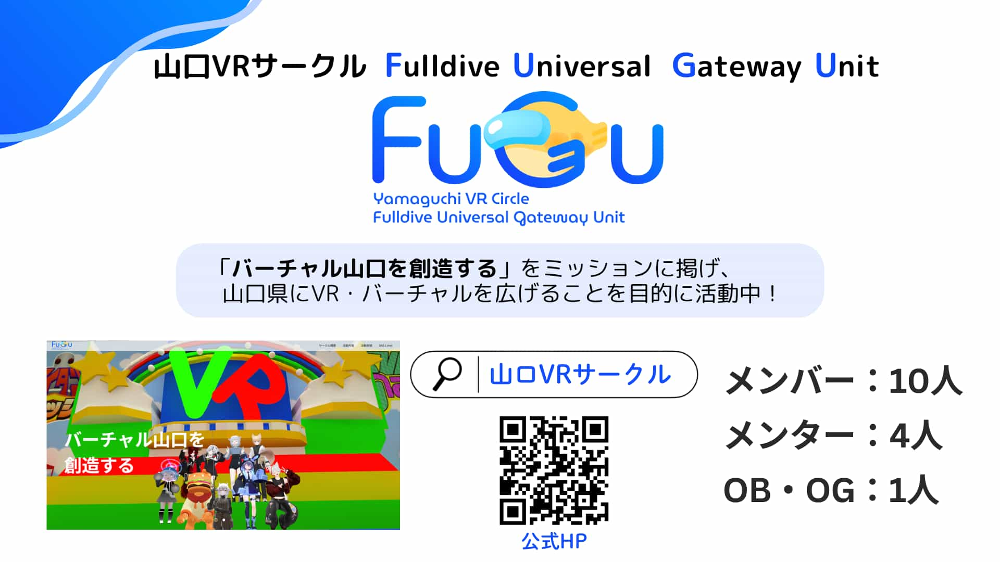
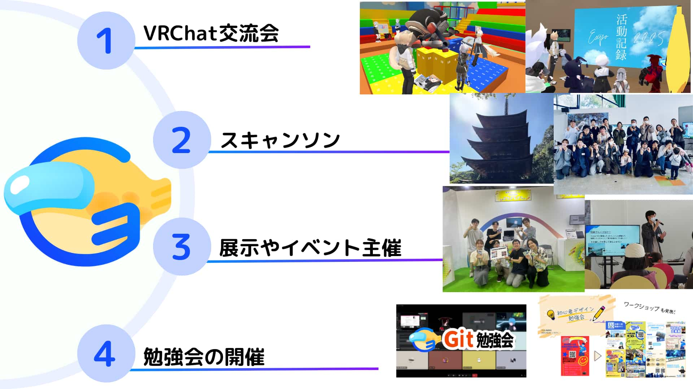
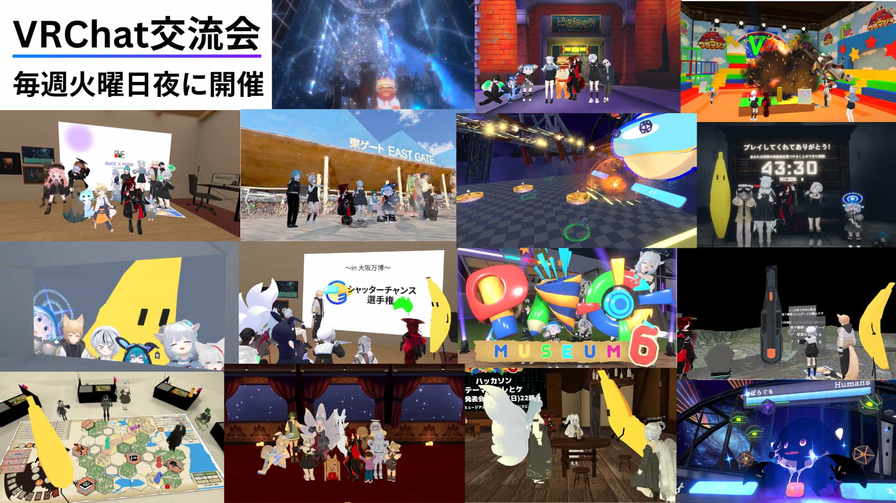
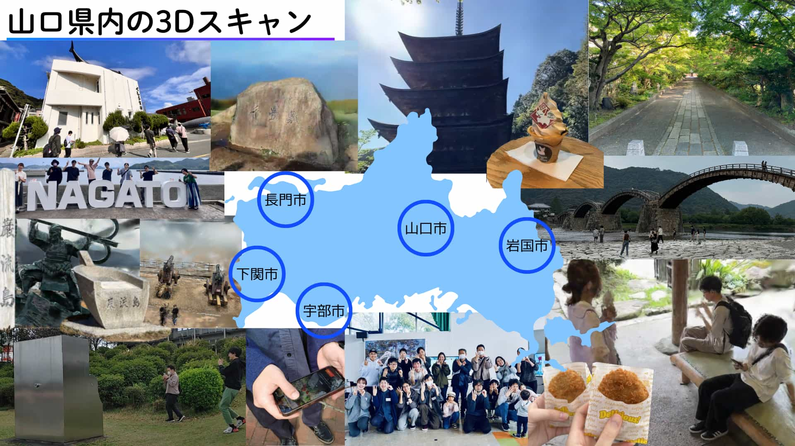
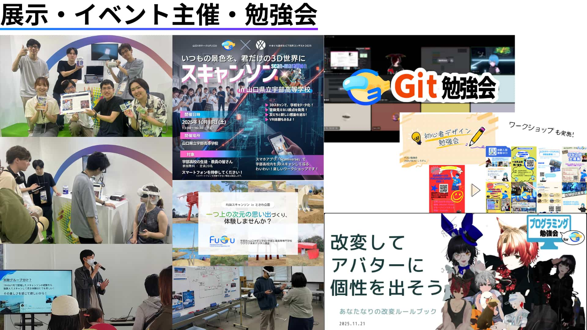
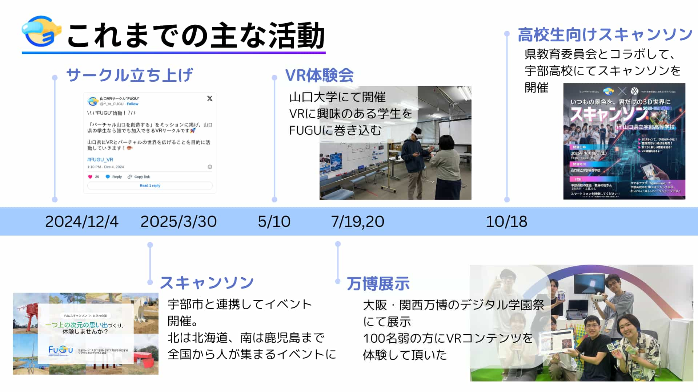

# 1. FUGUとは？
山口VRサークルFUGU（Fulldive Universal Gateway Unit）は、2024年12月4日に始動した、山口県内の学生なら誰でも参加できる、学生VRサークルです。  
代表のToLpazが、地方におけるXRイベントや仲間の少なさを解消し、「身近に語れる仲間と場所が欲しい！」という願いから立ち上げました。  

# 2. ミッション： 「バーチャル山口を創造する」
私たちは、単にVRで遊ぶだけでなく、 **「バーチャル山口を創造する」** というミッションを掲げています。 山口県というローカルな場所にベクトルを向け、地域の魅力をデジタル技術で切り取り、VR空間に再構築することで、山口にVRとバーチャルの世界を広めることを目的としています。

# 3. 主な活動内容
初心者からクリエイターまで、それぞれの楽しみ方で活動しています。
- VRChat交流会（週1回）:    
メンバーでVRChat内の様々なワールドを巡り、交流することで絆を深めます。
- スキャンソン & 勉強会（月1回）:    
リアルで集まり、スマートフォン1つで身の回りのものを3Dスキャンする「スキャンソン」を行ったり、技術等について学ぶ勉強会を開催したりしています。
- コンテンツ制作:   
2025年大阪・関西万博への出展作品制作や、地域行政と連携したイベントの企画、部室ワールドの作成やハッカソン参加など、個人でもチームでも制作に取り組んでいます。

# 4. これまでの実績
設立から1年の間で、山口のXRシーンを牽引する活動を展開してきました。
- 2025年大阪・関西万博「デジタル学園祭」出展:   
山口の四季と魅力を詰め込んだVR作品『長州スキャンロード ～四季彩の軌跡～』を展示し、2日間で90名以上の方に体験していただきました。
- 宇部市連携「FUGUスキャンソン」:   
彫刻のまち・宇部市の「ときわ公園」にて、行政と連携した3Dスキャンイベントを開催。自分たちでスキャンした彫刻をVRコンテンツとして「作品」に昇華させるハッカソンも同時に行いました。
- 高校生向けスキャンソン：   
高校生向けにスキャンソン・VR体験をしていただくイベントを行いました。当日スキャンしたデータをVRChat上のワールドに置き、VRChat上で体験していただきました。

# 5. さいごに
私たちは「バーチャル山口を創造する」というミッションを掲げ、地方だからこそできるXRの形を模索しています。  
情報の少なさや物理的な距離を理由に諦めるのではなく、山口という土地にある唯一無二の魅力を、3Dスキャンを使ってバーチャル空間に描き出しています。   
地方だから、田舎だからと諦めることなく、FUGUはこれからも活動を続けていきます！  

--------------------------------------------------------------------------------
【詳細・お問い合わせ】
- 公式HP: [山口VRサークルFUGU](https://yamaguchi-vr-fugu.vercel.app/)
- 公式X: [@Y_vr_FUGU](https://x.com/Y_vr_FUGU)

--------------------------------------------------------------------------------

<!--
HTML記法もぶっこめるよ。でも基本はMarkdon 
-->