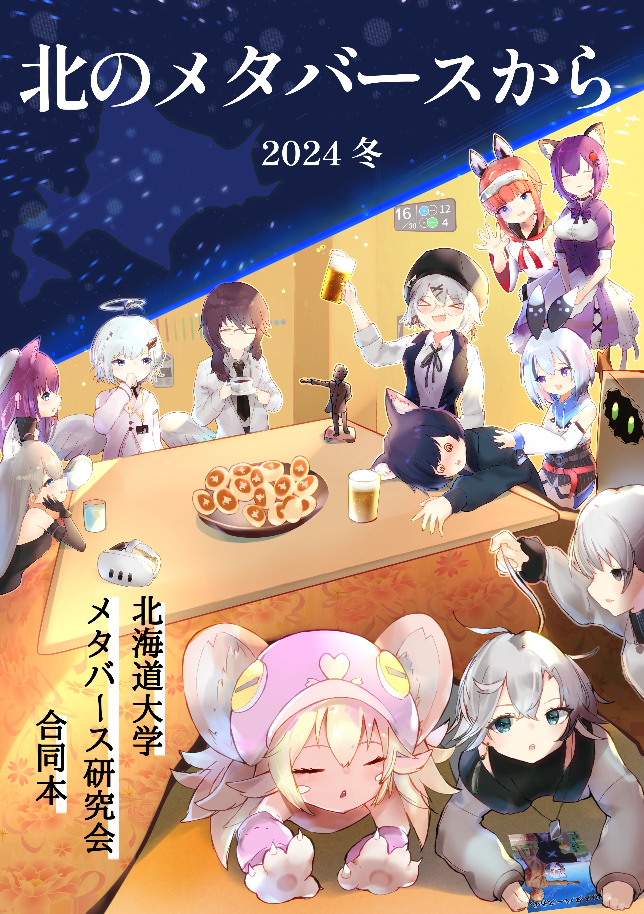

# 1. メタ研とは？

### 北海道大学メタバース研究会（メタ研）の概要
**基本情報**
- **設立**: 2022年9月15日 
- **構成メンバー**: 約65%が北海道大学の学生ですが、室蘭工業大学、北海道科学大学、北海道情報大学など、北海道内の他大学の学生も所属しています。
- **規模**: Discordサーバー参加者は約60名（ただしアクティブメンバーは約12名程度）。

### 活動理念
- **Mission (Act in Metaverse)**: 私たちは、北大生のメタバースにおける健全な交流を促進します。また、北海道大学のメタバース活用に積極的に協力し、北海道大学とメタバースコミュニティに貢献します
- **Vision (Create Stage)**: 私たちは、メンバーがメタバースで交流し、自身のクリエイティビティを発揮してイノベーションを創造できる環境を提供します。また、北大生と北海道大学のメタバース参画を推進する基盤を提供します
- **Value (Step Forward)**: 私たちは、サークルでの活動を通して学問的・人間的・技術的に成長します

# 2. 主な活動内容

メタ研の活動は大きく分けて「日常的な交流」と「対外的なプロジェクト」の2軸があります。

### 定例会（週1回）
VRChat上で行われる定期的な集まりです。メンバー同士の交流の場として機能しており、ほぼ欠かさず3年間実施されています。

### 北大祭への出展
- **VR体験会**: 来場者にVRゴーグルを装着してもらい、メタバース空間を体験してもらう企画
- **バーチャル北大祭**: キャンパスを再現したワールドに、他サークル（映画研究会、イラスト研究会など）の作品展示や模擬店の雰囲気を再現する企画

### コミックマーケット（コミケ）参加
合同誌『北のメタバースから』を制作・頒布し、活動で得た知見や各メンバーの体験記をアウトプットしています

# 3. 実績

### 「2025年ターゲット」の達成
設立当初に掲げた「2025年までに北海道大学の具体的なメタバースの活用を実現する」という目標を見事に達成しました。
当初は絵空事と思われた「北大祭をバーチャル空間に持ってくる」というプロジェクトや、キャンパスの部分的なバーチャル化を成功させました。

### バーチャル北大祭の大成功
2025年のバーチャル北大祭では、のべ33団体からの出展協力を得て、メインストリートに屋台が並ぶ雰囲気を再現しました。
ワールドへのVisit数（来場者数）は3,000を超え、前年の約2倍を記録しました。
来場者からは「北大祭に本州から行けるとは思わなかった」「懐かしい感じが凄かった、毎年行きたい」といった肯定的な感想が多く寄せられました。

### 「バーチャル北大」の制作と公認
エンジンかずみ氏との共同制作により、北大のメインストリートをVRChat上に再現した「バーチャル北大」を公開し、SNSで話題となりました。
この取り組みは「バーチャル北大の公認」という成果につながっています。

# 4. コミュニティとしての魅力

### 「ゆるさ」と「居場所」の維持
メタ研は「コミュニケーションや場の提供を重視するサークル」としてのアイデンティティを確立しており、様々な趣味を持つメンバーが集まる場となっています。

### 現実とバーチャルの融合
VRChat上の活動だけでなく、北大祭や打ち上げなどで現実（リアル）に集まることも大切にしており、対面ならではの楽しさを共有しています。
他サークル（映画研究会、イラスト研究会、エレクトーンサークルなど）とのコラボレーションも積極的に行い、リアルとVRの同時演奏会などを実現させました。

--------------------------------------------------------------------------------
【お問い合わせ】
- 公式X: [@HU_Metaverse](https://x.com/HU_Metaverse)

--------------------------------------------------------------------------------
