## はじめに

2025年度のKAIT VRの代表を務めている、**びーんだいふく**です。

本記事では、この1年間、個性豊かな部員たちと共に駆け抜けてきた活動の軌跡を、振り返っていきたいと思います。

## KAIT VRとは
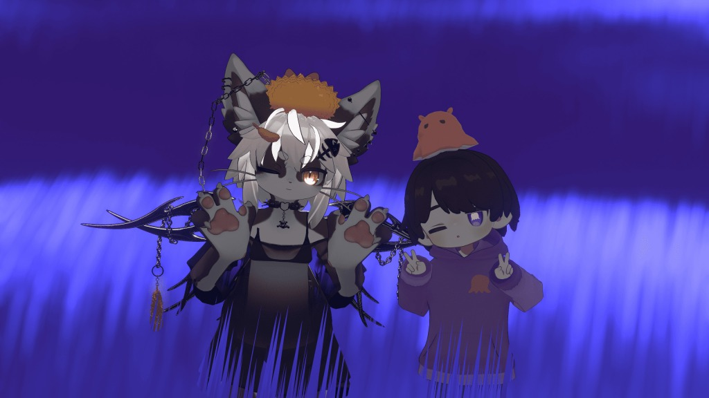

KAIT VRは、2017年に発足した**神奈川工科大学公認のVRサークル**です。
今年度は**32名**と、多くの部員に恵まれました。

私たちの最大の特徴は、**新入部員のほとんどがXR未経験者**であることです。「VRをやってみたい」「面白いものを作ってみたい」という好奇心ひとつで集まったメンバーが、サークル内での学びを通じてスキルを身に付け、自分たちの表現を形にしています。

## 体験・創作・展示のサイクル

KAIT VRでは、技術向上とモチベーション維持のために「**体験・創作・展示**」という3つのステップを大切にしています。

### ▷ 体験する
まずは話題のVRゲームやメタバース空間、外部の展示会に触れ、「何が面白いのか」を分析することから始まります。

| 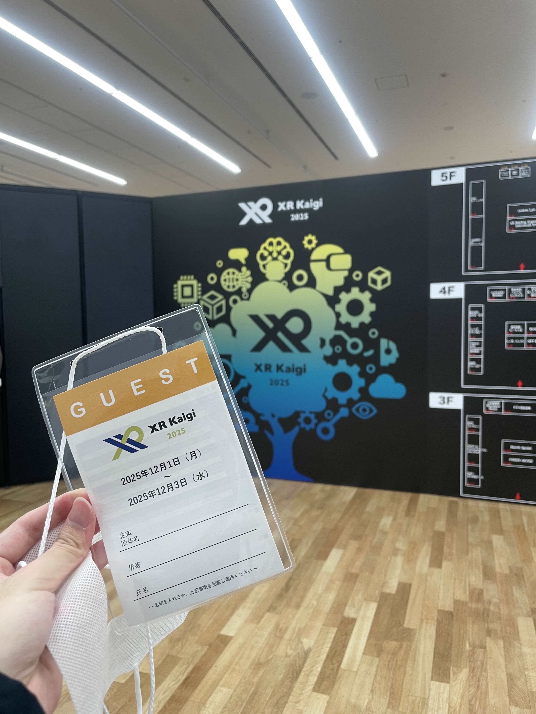 |  |
| :---: | :---: |
| *XR Kaigi 2025* | *神奈川工科大学のブースを体験* |

### ▷ 創作する
UnityやGitを用いた開発講習会、技術共有を行い、実際に手を動かして作品を作ります。今年度は新しい技術に挑戦する部員も増えました。

| 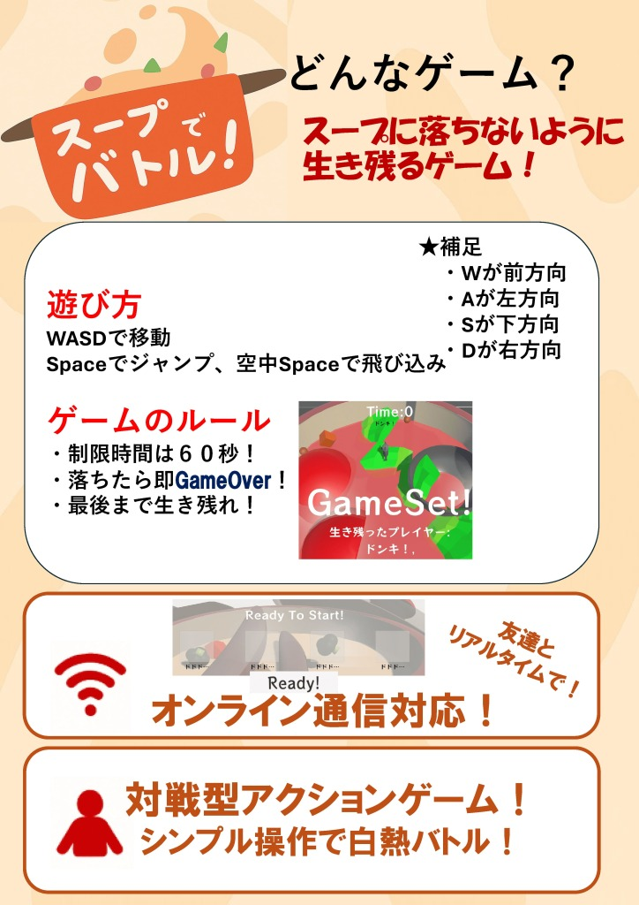 | 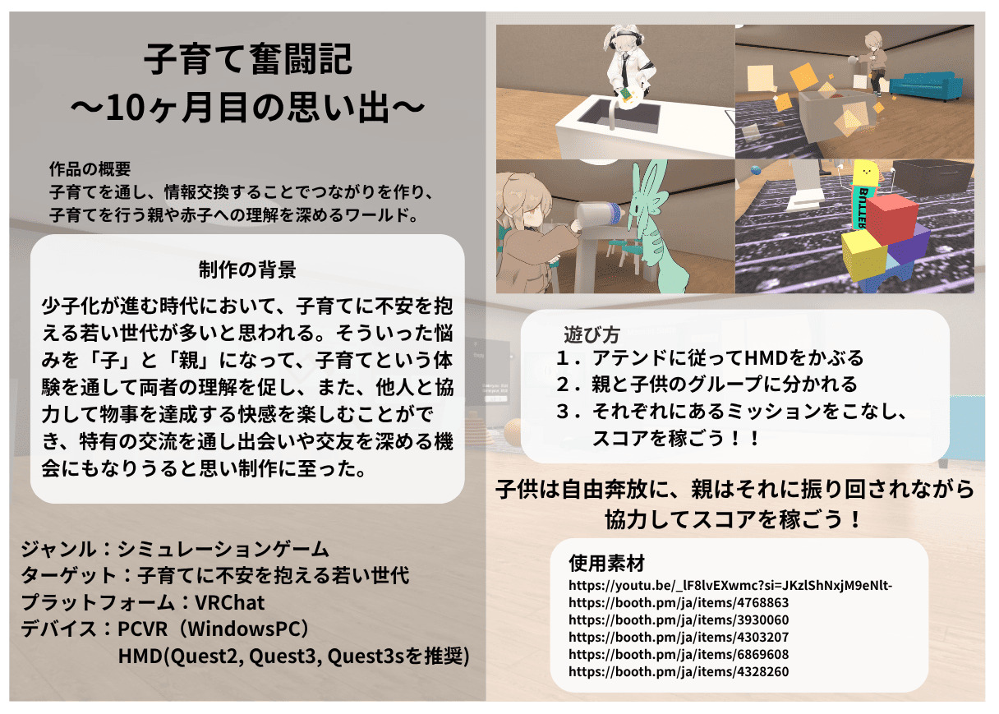 |
| :---: | :---: |
| *新入部員チームの成果物* | *IVRCメタバース部門に提出した作品* |

### ▷ 展示する
作った作品を自分たちだけで終わらせず、学園祭や外部イベントで一般の方に体験してもらいます。ユーザーの反応を直接見ることで、次の制作への最大の糧となります。
とくに今年度の学園祭では、初となる講義室展示と飲食屋台のダブル出展を果たしました！

| 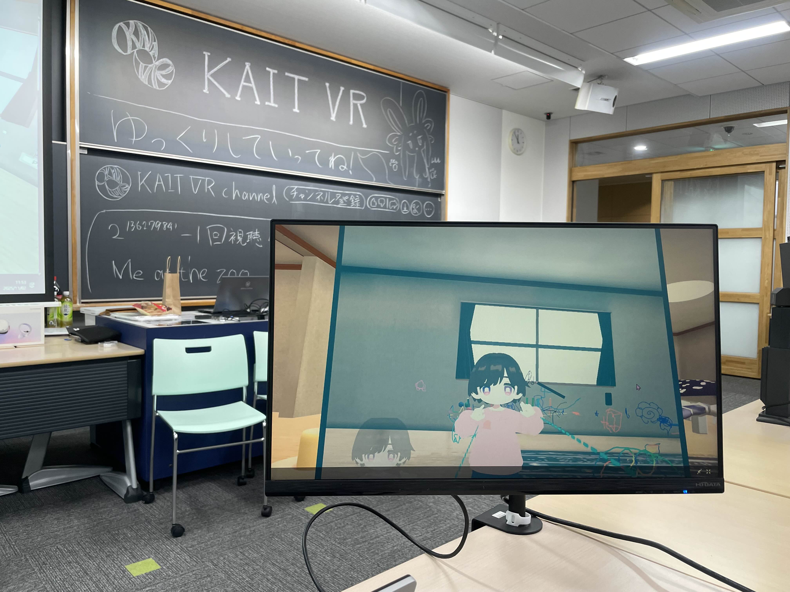 | 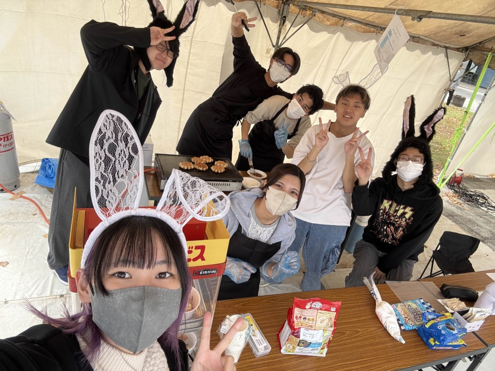 |
| :---: | :---: |
| *講義室展示 -活動展示＆VRの体験* | *飲食屋台 -ワッフルの販売* |

## NUMAでの活動

* **ヌマッカソン**

共に活動した事が無かったメンバー同士でチームを組み、短期間で作品を制作しました。限られた時間の中でアイデアを出し合い、交流を深めることができました。

| 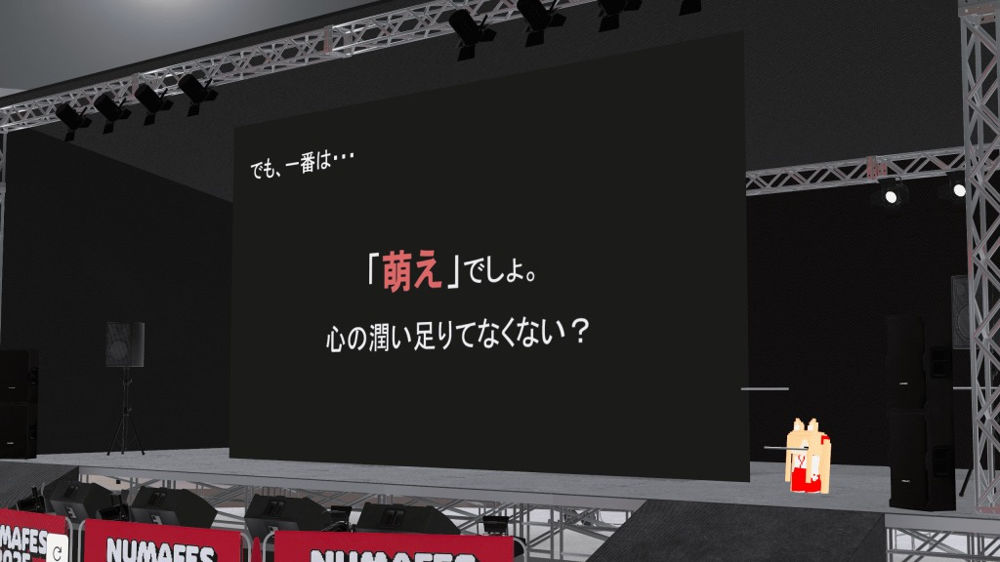 | 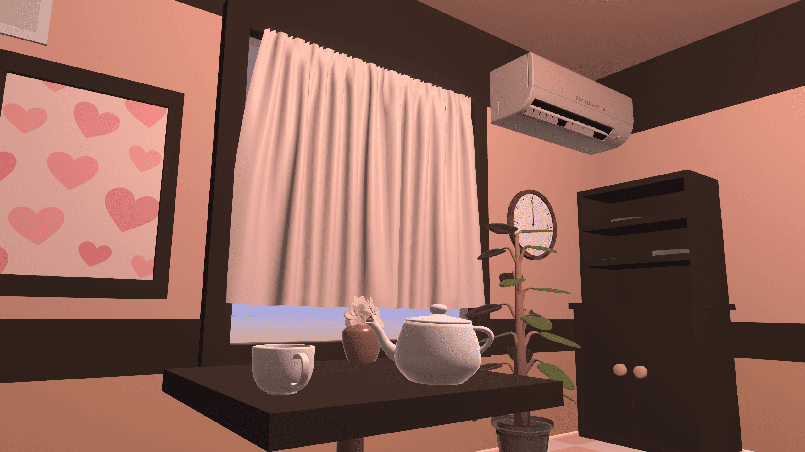 |
| :---: | :---: |
| *第一回 ヌマッカソン* | *制作したワールド* |

* **NUMAを通じた交流活動**

他大学のVRサークルさんとVRChat内でお話ししたり、ゲームワールドを巡ったり。VRサークル同士の親睦を深める良い機会に恵まれました。また、第2回サークル対談では、仮想空間研究会さんと代表者どうしで活動内容や組織運営の悩みなどを語り、お互い大いに刺激を受けました。

| 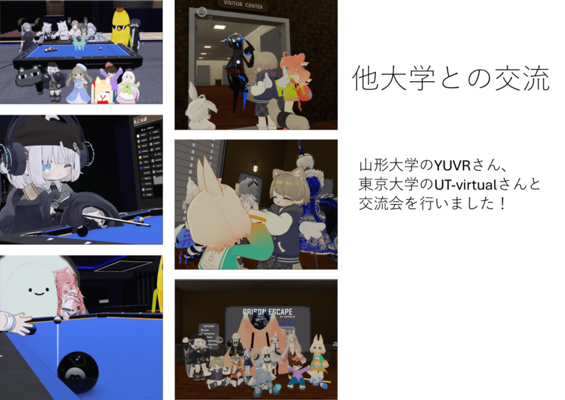 | 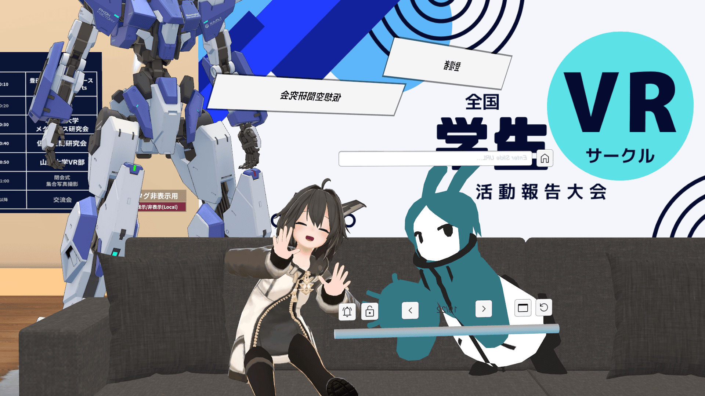 |
| :---: | :---: |
| *メタバース交流会* | *第2回サークル対談* |

* **全国学生VRサークル活動報告大会**
全国のVRサークルが集まる中、今年度のサークルの歩みを発表しました。自分たちの活動を客観的に振り返り、外部から評価をいただける貴重な機会となりました。

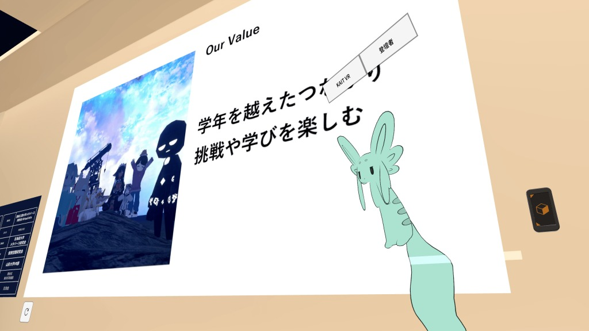
*全国学生VRサークル活動報告大会*

## おわりに

ここまで読んでいただき、ありがとうございました。

この1年間を振り返ると、組織・運営モデルの改革や部員との対話など、技術面以外でも多くの挑戦があった年でした。部員全員がそれぞれの「好き」を形にできる環境を少しでも作れていれば幸いに思います。

これからも成長し続ける、私たちKAIT VRをよろしくお願いします！！

著者：びーんだいふく

---

### 【SNS・お問い合わせ】
- 公式X: [@KaitVR_info](https://x.com/KaitVR_info)
- mail: kaitvr@kait-circle.jp