# メタ創 - 日本大学 学部横断メタバース・デジタル創作コミュニティ

『N.U.メタバースの可能性を創造しよう！』（略：メタ創）は、日本大学の理工学部・工学部・芸術学部の学部生で構成される、
2025 年 4 月に発足した、顧問を置かず学生だけで自由に創作活動を行う、大学本部直轄のプロジェクト団体です！

プロジェクトというのは、『日大生のやってみたいを実現するプロジェクト』という制度を用いた学生団体のことです。
文化の発展 or 日本大学の発展 or SDGs いずれかに寄与するやってみたいことを日本大学から 1 年間手厚いご支援をしていただけるという制度となっており、毎年 20 ～ 40 団体がこちらの制度を活用して日本大学から学生団体が立ち上がっています。
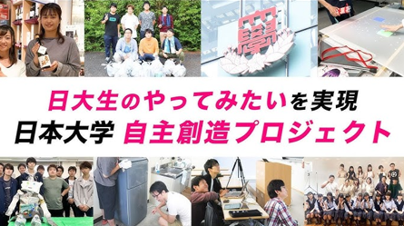

---

## メンバー構成

- 理工学部（千葉県・船橋キャンパス）：5 名
- 芸術学部（東京都・練馬キャンパス）：3 名
- 工学部（福島県・郡山キャンパス）：2 名

**合計：10 名**

---

## 活動場所

メンバーが全国に散らばっているため、活動の中心は **Discord** で行っています。

- Discord：企画、ミーティング、制作進行
- VRChat：ワールド制作、動作確認
- イベント会場：展示など

オンラインを活用し、場所に縛られず柔軟に活動しています。

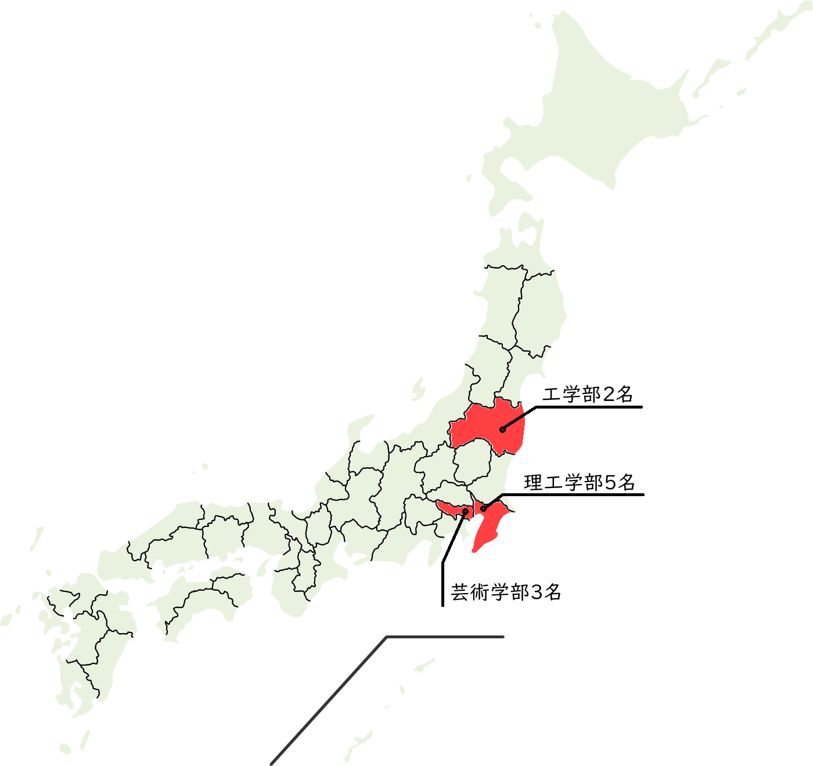
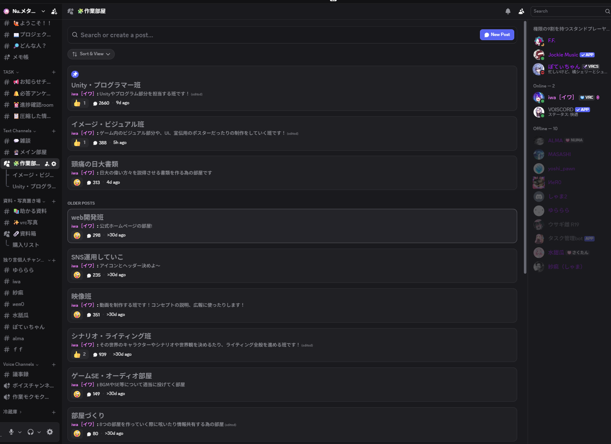

Discord

---

## 今年度の主な活動

今年度は、0 からの学生団体の立ち上げや、ゲームワールド制作、外部イベントへの参加・発表・展示を行いました！

- 0 からのメンバー集め
- Discord サーバー等の創作環境の充実化
- ホームページ制作
- 日本大学公認化
- ４次元空間を彷徨える VRChat ゲームワールドの制作
- 多数の動画を制作
- IVRC メタバース部門での発表と出展（受賞）
- Vket2025Winter での出展
- 少人数メンバーで、VketReal や XR Kaigi、ハッカソン、その他技術系イベントに参加
- NUMA 経由での他大学のメタバースサークルとの交流
- 超異分野学での出展

---

## イベント出展の様子

    
    
IVRC現地展示

    
    
制作ワールドで記念写真

    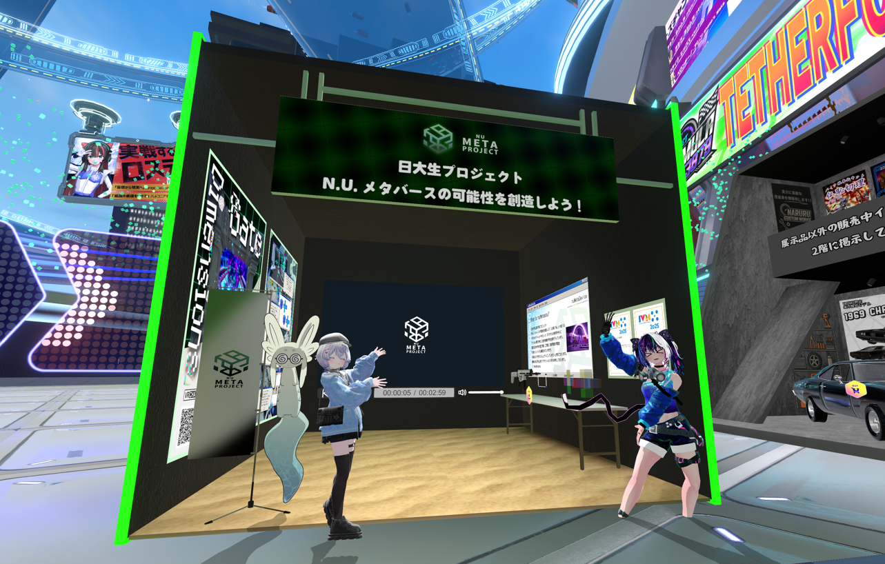
    
VketWinter出展

---

## ポスター制作

発足直後には、メンバー募集を目的としたポスター制作をしました！
また、IVRC の展示で配布するワールド紹介ポスターなども作成しています！

  

    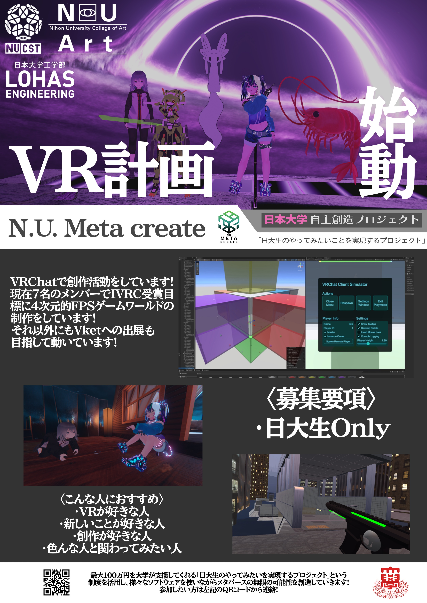
    
メンバー募集ポスター（4月制作）

  

  

    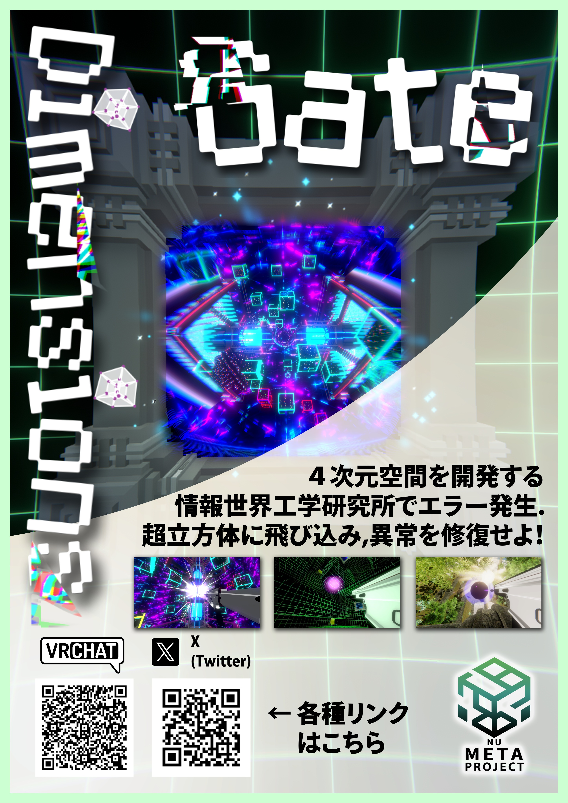
    
IVRCで配布したポスター

  

---

## 広報活動

メタ創では、日々の活動を積極的に外部に向けて発信しています！

- X（Twitter）での継続的な情報発信
- ホームページ作成 ＋ ブログ機能を実装
- YouTube に活動動画を掲載

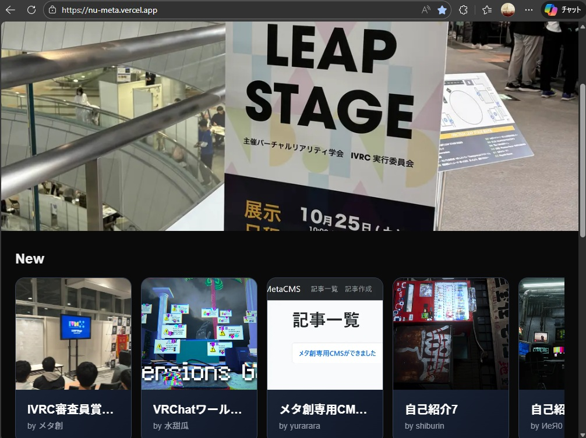
ホームページでの広報
 

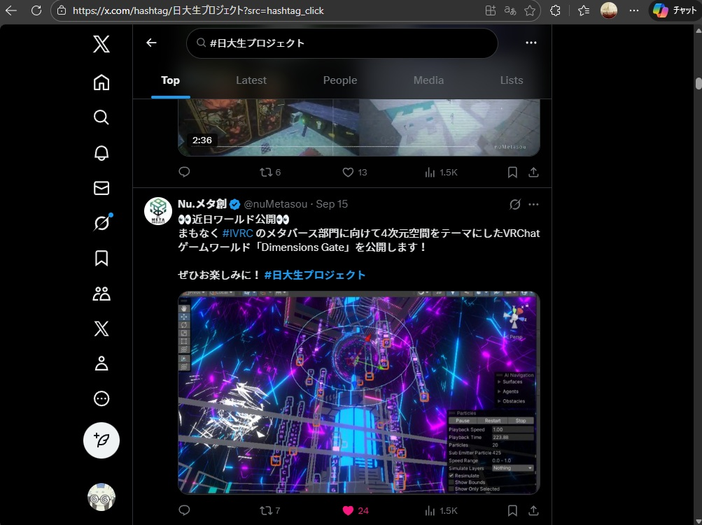
X での広報
 

  <iframe
    src="https://www.youtube.com/embed/HHPRAg5ijXE?si=IU1PxKqYRhv2YtTh"
    style="position: absolute; top: 0; left: 0; width: 100%; height: 100%;"
    frameborder="0"
    allowfullscreen
  ></iframe>

---

## リンク

  <!-- ホームページ -->
  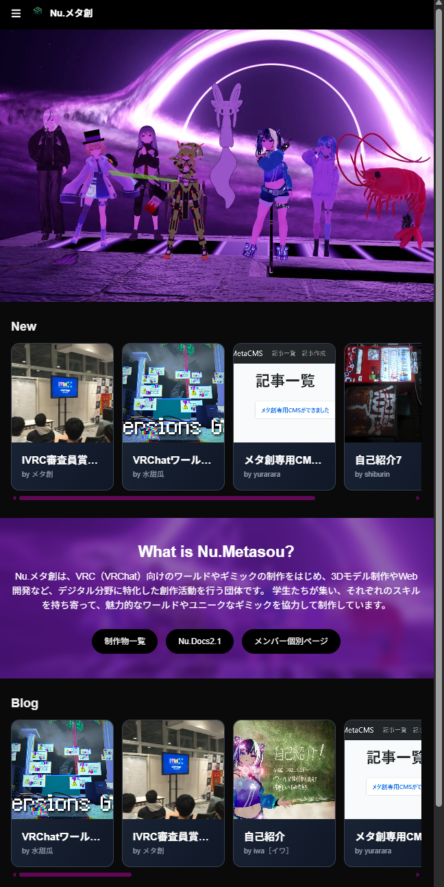
  
<a href="https://nu-meta.vercel.app/">ホームページ</a>

  
https://nu-meta.vercel.app/

  

  <!-- YouTube -->
  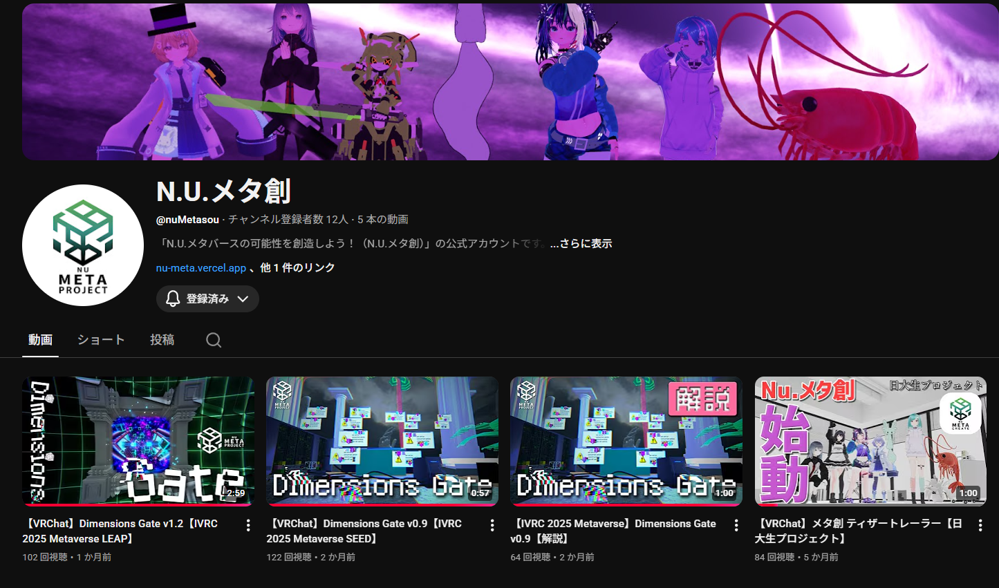
  
<a href="https://www.youtube.com/channel/UCP50CAz2iyb8KKa3EV5BGKw">YouTube</a>

  
https://www.youtube.com/channel/UCP50CAz2iyb8KKa3EV5BGKw

  

  <!-- Booth -->
  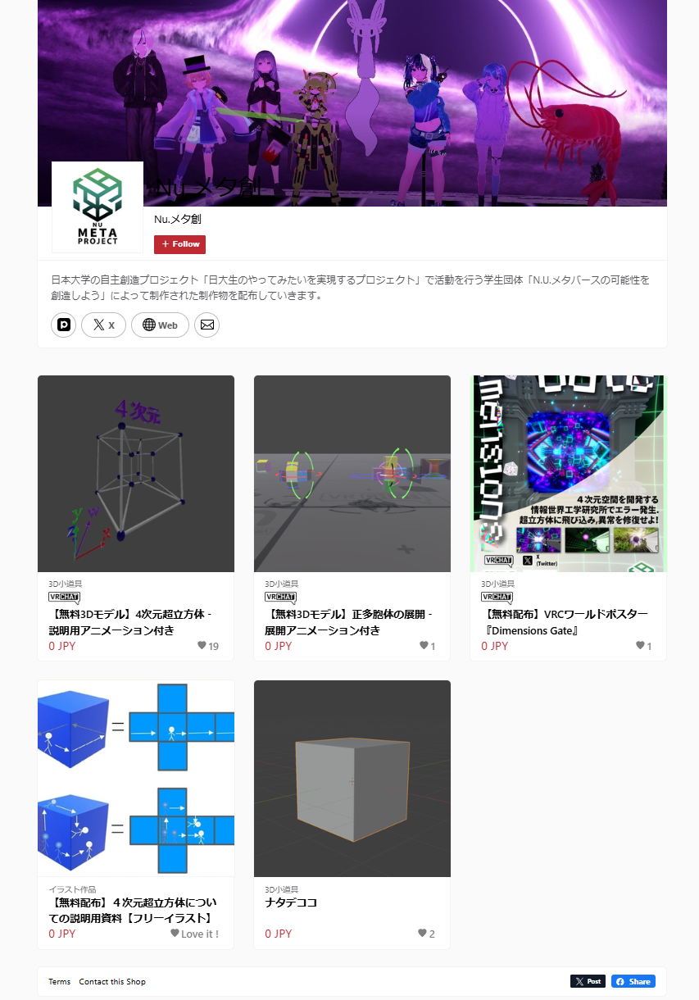
  
<a href="https://numetaproject.booth.pm/">Booth</a>

  
https://numetaproject.booth.pm/

---

## 来年度に向けて

プロジェクトは毎年申請制のため、メタ創は形を変えつつも来年度も活動を継続予定です。  
NUMA の皆さん、来年度もよろしくお願いします！
