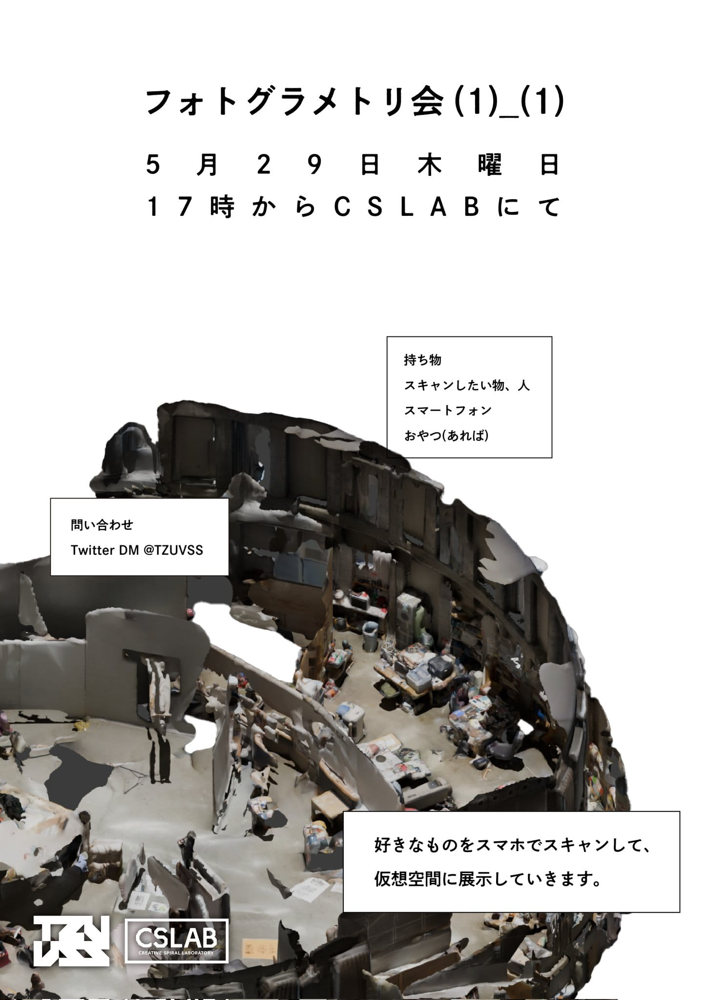
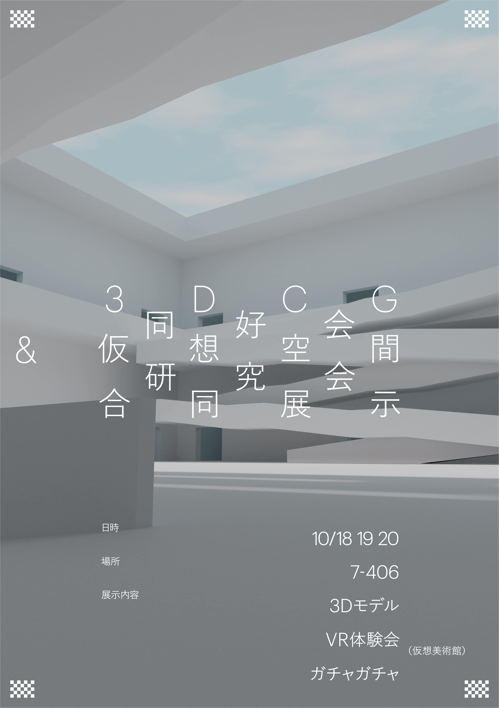
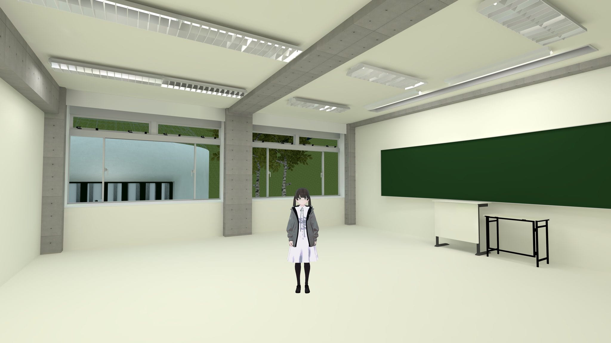
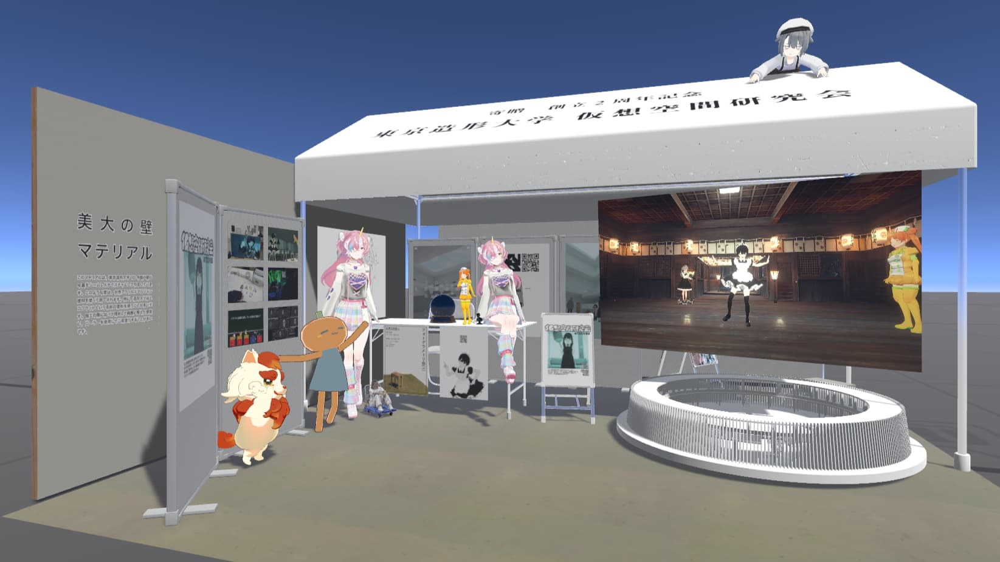
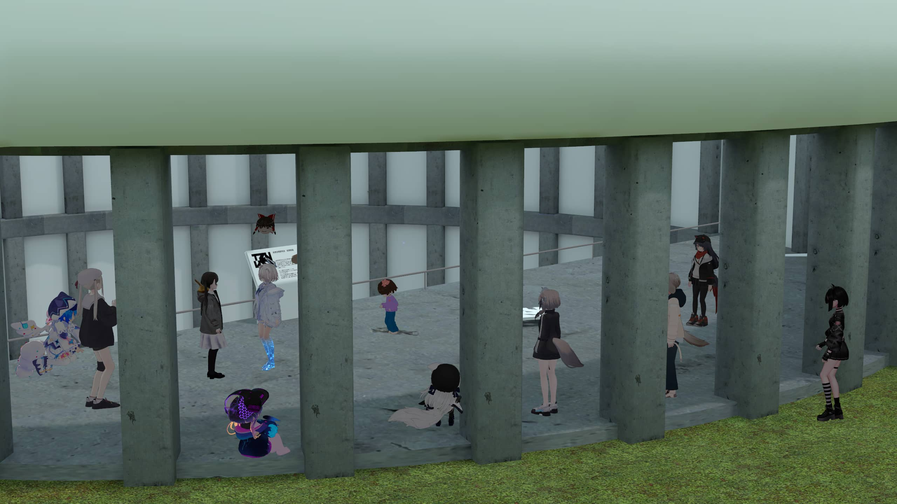
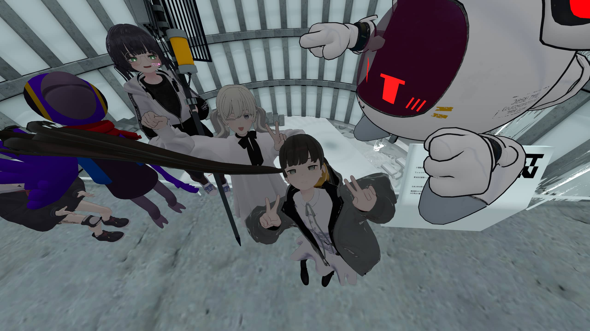

## はじめまして

美大で数少ないVRサークルである私たちは、仮想空間での表現活動の研究を目的として活動しています。
あなたも一緒に何か作りませんか？

## 仮想空間研究会とは

**仮想空間研究会**は、**東京造形大学**で2023年度に設立した大学公認のVRSNS向け制作サークルです。
立ち上げ当初は5名程度でしたが、今では約70名ほどの学生が所属し、VRChatをはじめとしたVRSNS向けのワールド・アバター制作に取り組んでいます。

### 活動内容
毎月2回、DiscordやVRSNSを使用したオンラインでの定期交流会を行っています。

また、不定期でBlenderやUnity、フォトグラメトリなどを活用したワークショップなども開催しています。

毎年10月に行われるCS祭(文化祭)での成果物展示を目標とし、設立以来、毎年出展することができています。

  

    
    
フォトグラメトリ会ポスター

  

  

    
    
CS祭ポスター

  

  
  

   展示教室の再現(CS祭)
  

### NUMAでの活動

3月に開催されたNUMA祭にて、ブース出展・会場制作で参加しました。過去に開催したイベントのポスター、部員の制作物などを展示しています。

  
  

    NUMA祭 出展ブース
  

6月に開催されたヌマッカソンにて、大学内にある施設をモチーフにしたバーチャル部室を制作しました。
絵画専攻の部員がデザインを起こし、彫刻専攻のメンバーが形を作り...などと部員それぞれの能力が生かされた大満足の共同制作になりました。
今後も手を加えながら部員の集まる場所として使っていく予定です。

  
  

  
  

    ヌマッカソンにて制作した「バーチャル部室」に集まるメンバー
  

 

--------------------------------------------------------------------------------

### SNS・お問い合わせ
X(旧Twitter): [@TZUVSS](https://x.com/TZUVSS)
  
Instagram: [tzuvss](https://www.instagram.com/tzuvss/)
