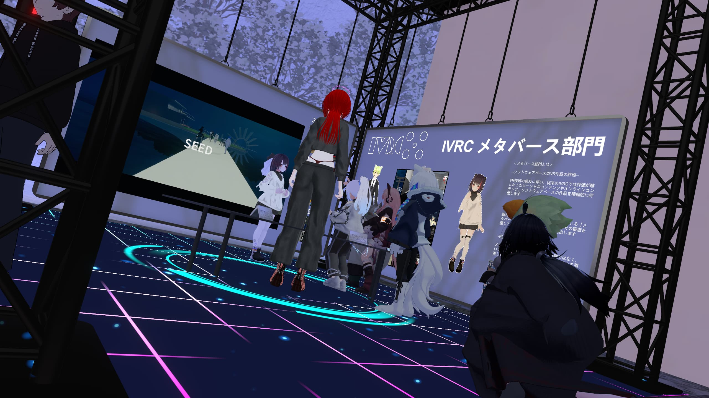
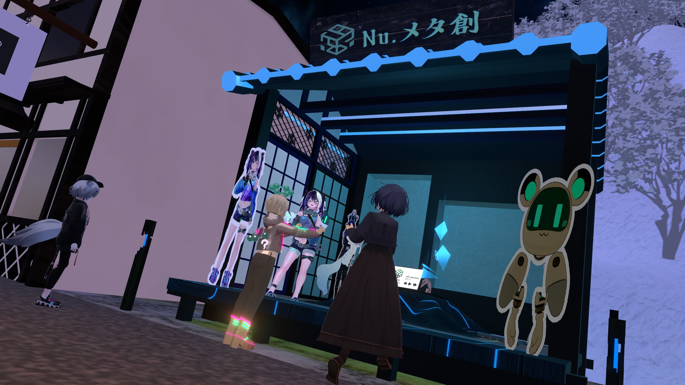
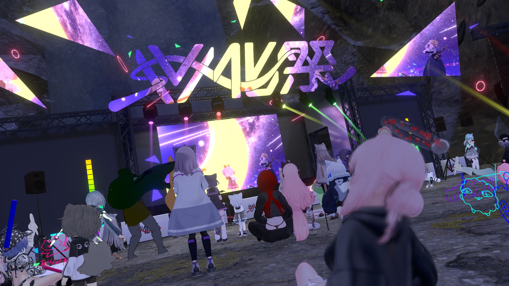
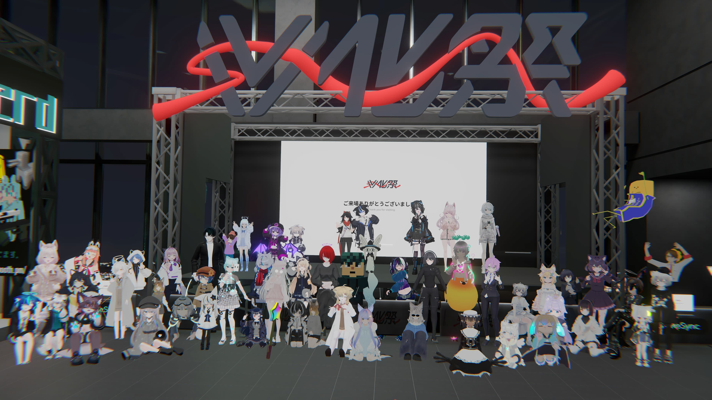

## はじめに

2026年3月、VRChat上にて学生合同イベント「V化祭2026」を開催しました。

本イベントは、NUMAおよびJVSLを中心とした学生団体によって企画・運営されたものであり、  
全国の学生が集い、展示・発表・交流を行う場として実施されました。

筆者は、V化祭共同代表として本イベント全体の運営に携わるとともに、  
NUMA副代表、山形大学VR部副代表として、主に企画およびワールド制作の面から関わりました。

## テーマ「むすび」について

今回のV化祭では、「むすび」というテーマを掲げました。

このテーマは、  
サークル同士、学生同士のつながり、  
そしてこの1年間の活動の集大成を、  
ひとつの言葉で表せないかと考えたことがきっかけです。

同時に、「ここで生まれた関係が、この場で終わらず、次へとつながっていく」  
そんな場にしたいという思いも込めています。

実際にこの2日間、  
誰かの展示を見て会話が生まれたり、  
ステージをきっかけに人が集まったりと、  
それぞれの場所で小さな「むすび」が生まれていたように感じました。

それらは目に見えるものではありませんが、  
このイベントの中で確かに存在していたものだと思っています。

## イベント概要と来場者数

V化祭2026では、

- 各サークルによる展示ブース  
- DJ・VJによる音楽イベント  
- ポスター・ギャラリー展示  

といった要素を組み合わせ、  
文化祭のように自由に回遊しながら楽しめる構成としました。

その結果、**2日間でのべ400人弱の来場**があり、  
学生主体のイベントとしては大きな規模での開催となりました。

数字としての規模以上に、  
同じ空間にこれだけ多くの学生が集まり、  
それぞれの活動を持ち寄って共有できたこと自体に、  
大きな意味があったと感じています。

## DAY1（NUMA側）について

NUMAが中心となって運営したDAY1では、  
大学VRサークルを主体とした展示およびステージイベントを実施しました。

各サークルのブースでは、  
それぞれがこれまで取り組んできた制作物や活動が並び、  
来場者が自由に見て回りながら交流できる場となりました。

また、DJ・VJによるステージでは、  
学生自身が場をつくり、盛り上げる存在として機能しており、  
単なる発表の場ではなく、「一緒に場をつくる」感覚が強くあったように思います。

このDAY1を通して、  
NUMAが目指している「サークル同士がゆるやかにつながる場」というものが、  
ひとつ形になったのではないかと感じています。

## 今後に向けて

V化祭は、今回で完結するものではなく、  
来年度以降も継続していくことを前提とした取り組みです。

今回の「むすび」が、  
新しい活動やコラボレーションのきっかけとなり、  
また次の世代や次の地域へとつながっていくことを期待しています。

NUMAとしても、  
大学サークル同士のネットワークを活かしながら、  
こうした場を今後も継続的に生み出していきたいと考えています。

## おわりに

今回のV化祭2026は、  
多くの人の協力によって成り立ったイベントでした。

出展してくださったサークルの皆さま、  
出演してくださった皆さま、  
そして運営に関わってくださったすべての方々に、心より感謝申し上げます。

そして何より、この場に来てくださった皆さまのおかげで、  
このイベントは「場」として成立しました。

改めて、ありがとうございました。

またどこかで、今回の「むすび」が  
新しい形でつながっていくことを楽しみにしています。

### 筆者

まーしゅ  
（V化祭2026 共同代表 / NUMA 副代表 / 山形大学VR部 副代表）