2025年10月18日・19日、**NUMAはUT-virtualとともに、全国学生VRサークル活動報告大会 & XR制作物プレゼン 2025 を開催しました。**

今年も昨年に引き続きClusterとVRChatでの開催となり、**2日間にわたり13団体が大会に登壇・23件の制作物が発表**されました。

## 全国学生VRサークル活動報告大会とは

 

全国学生VRサークル活動報告大会とは、**全国の学生VRサークルが一堂に会し、1年間の活動報告・他団体との交流を行うイベント**です。

Day1の運営はUT-virtualが行い、Day2の運営はNUMAが行いました。それぞれの運営の特色が色濃く出るタイプの運営方式です。
例えば、開催されるプラットフォームが違います。**Day1はcluster、Day2はVRChatで開催されました。**

筆者としては、こういった共催方式のイベントは、**それぞれの団体の強みを活かしつつ、参加者に多様な体験を提供できる**ため、とても良い形式だと感じています。各団体が精通しているそれぞれのプラットフォームであって、clusterは**大人数で手軽に聞きやすく**、VRChatは没入感が高く**より深い交流**が可能です。

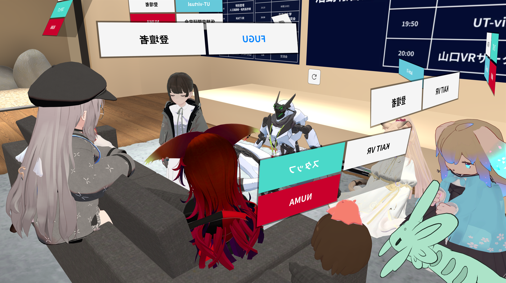
VRChatなら参加者の上に所属タグや、周囲の音量減衰を設定できる。
 

## Day2の様子
Day1の紹介はUT-virtualに譲り、NUMAが運営したDay2の様子を紹介します。

### 講演
Day2では、まずはじめに、東京大学の**入江英嗣**教授・**稲見昌彦**教授に講演を頂きました。

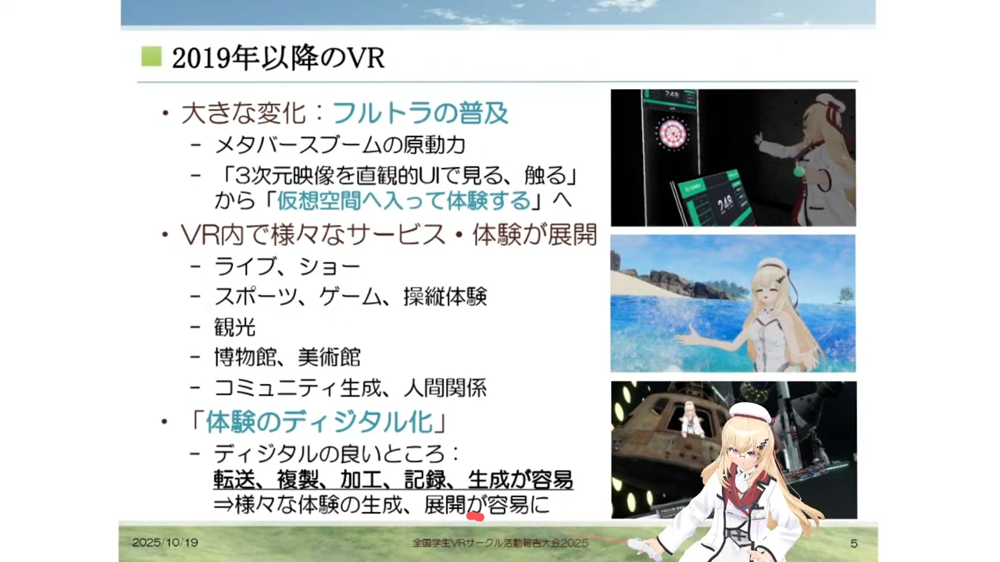
入江教授は、普段からVRChat内で講義なされています
 

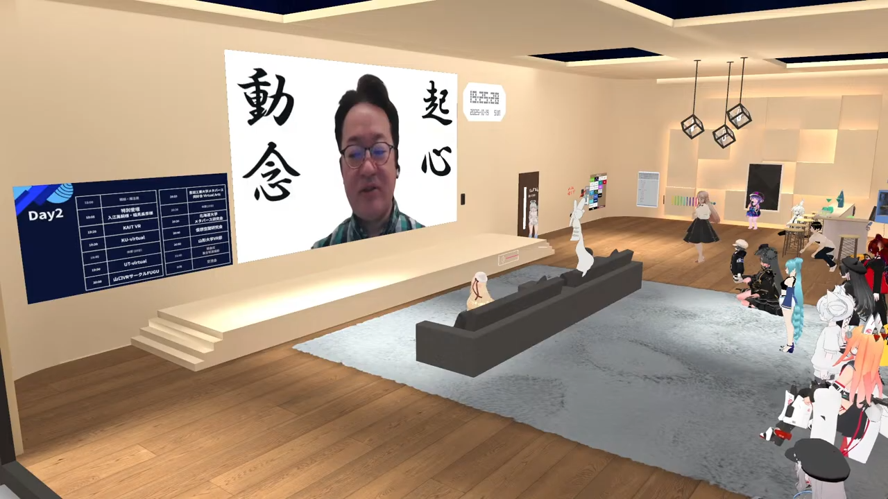
稲見教授は、多忙のためビデオ登壇され、力強い激励をなされました
 

### 各団体による活動報告
続いて、各団体の活動報告が行われました。

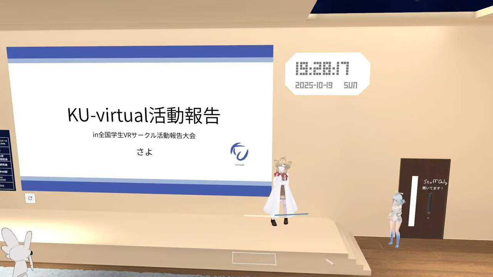
KU-virtual 代表 さよ
 

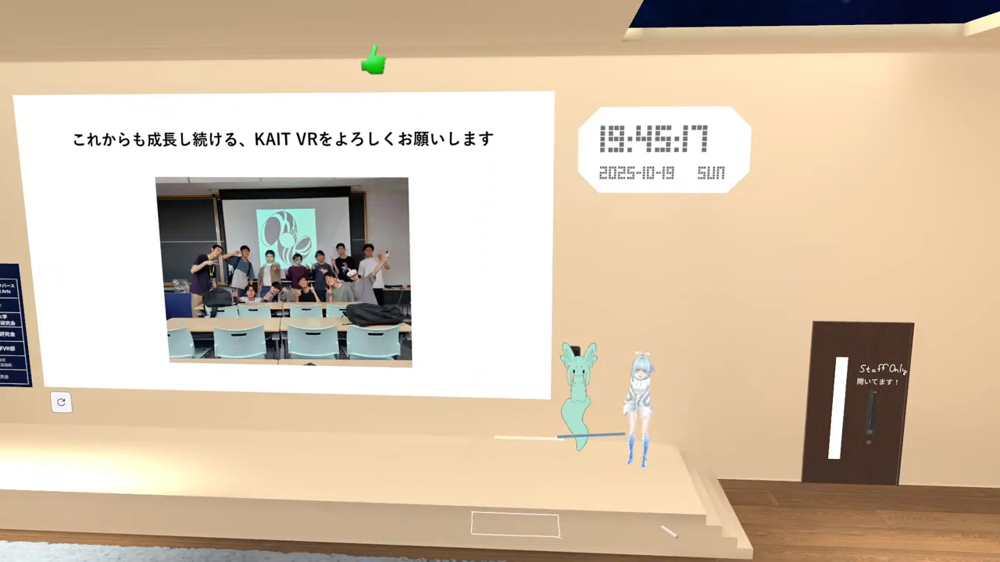
KAIT VR 代表 P-Misaki
 

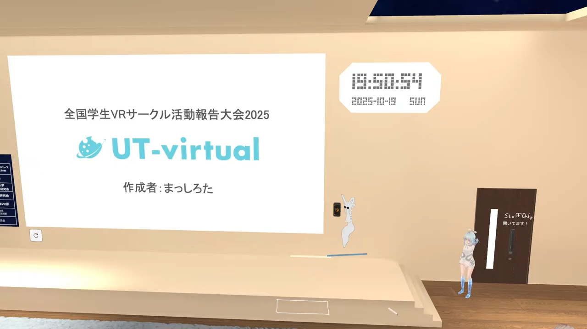
UT-virtual 代表 まっしろた
 

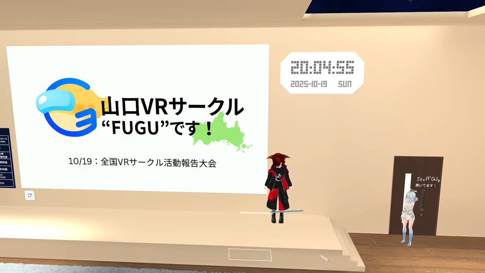
FUGU 代表 ToLpaz
 

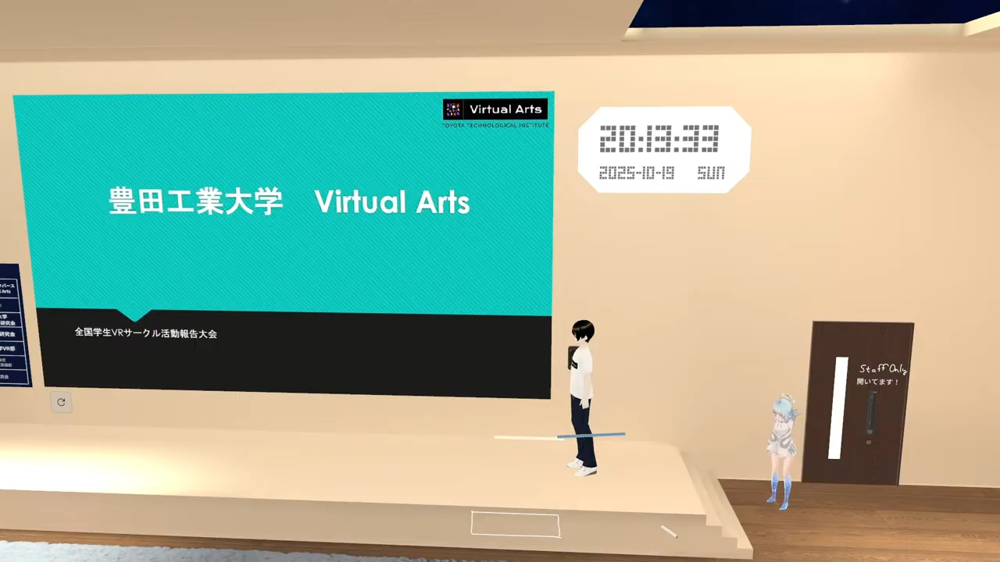
Virtual Arts 代表 _hairi 
 

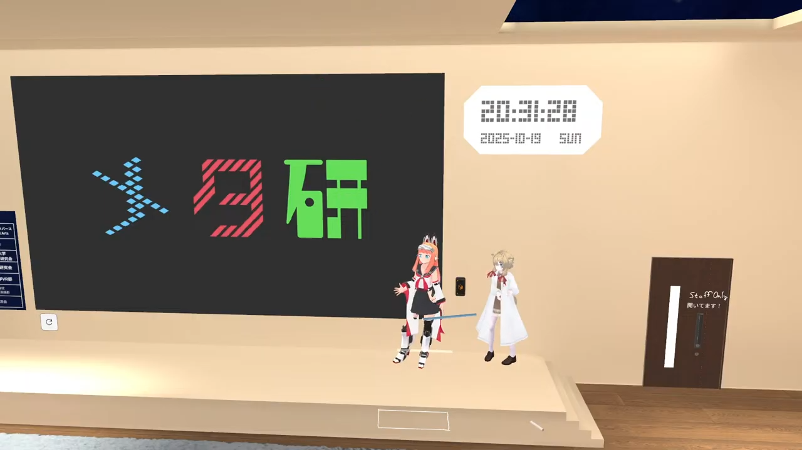
北海道大学メタバース研究会 副代表 CommEiki 
 

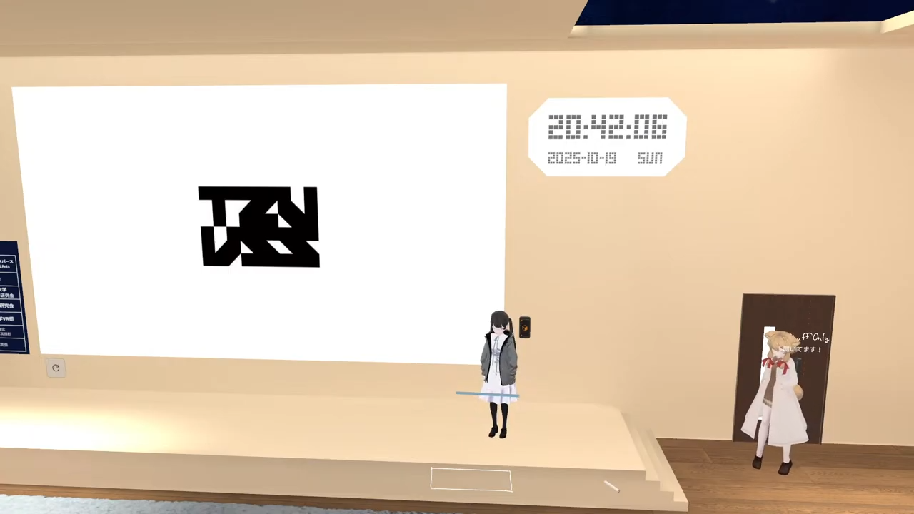
仮想空間研究会 管理人 usukawan 
 

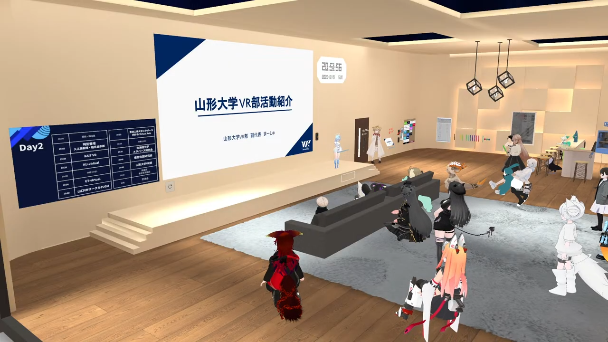
山形大学VR部 副代表 まーしゅ 
 

### 閉会式
2日間にわたる大会の最後の閉会式では、NUMAの代表である落雁.jpが挨拶を務めさせていただきました。

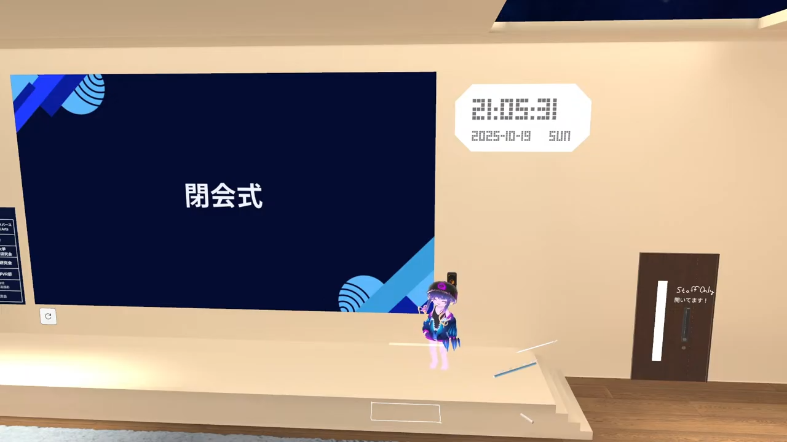
NUMA 代表 落雁.jp 
 

## NUMAの今後のイベントについて
次の大型イベントは、来年3月頃に開催予定の**V化祭**を予定しています。
もちろん、1年後には2026年版の**全国学生VRサークル活動報告大会**も開催できたらいいですね。

ぜひ、YouTubeのアーカイブもご覧いただき、次回のイベントにもご参加ください！

## 関連URL
- **全国学生VRサークル活動報告大会2025 &  公式サイト**: https://ut-virtual.github.io/ev-VRCircleMeeting2025/

### YouTubeアーカイブ
- **XR制作物プレゼン Day1**: https://youtube.com/live/HYL7NOQXTwU
- **全国学生VRサークル活動報告大会 Day1**: https://www.youtube.com/live/-U8JakZkNbI
- **XR制作物プレゼン Day2**: https://www.youtube.com/live/hSqVR3DCKIQ 
- **全国学生VRサークル活動報告大会 Day2**: https://www.youtube.com/live/XNDVpGQsR2U

### プラットフォーム
- **Cluster XR制作物プレゼン2025 Day1**: https://cluster.mu/e/d6b38113-2eb2-497c-afe1-d5e79db7fb5f
- **Cluster 全国学生VRサークル活動報告大会2025 Day1**: https://cluster.mu/e/bbbfe475-3229-43ad-989b-59690c413d83
- **VRChat Group 全国学生VRサークル活動報告大会**: https://vrchat.com/home/group/grp_ef29c6cc-6df9-4600-a9d8-b8956e5cb41c
    - Day2はここから参加

### 共催
- **UT-virtual**: https://utvirtual.tech/
- **NUMA 全日本大学メタバース連盟**: https://numa-meta.com/