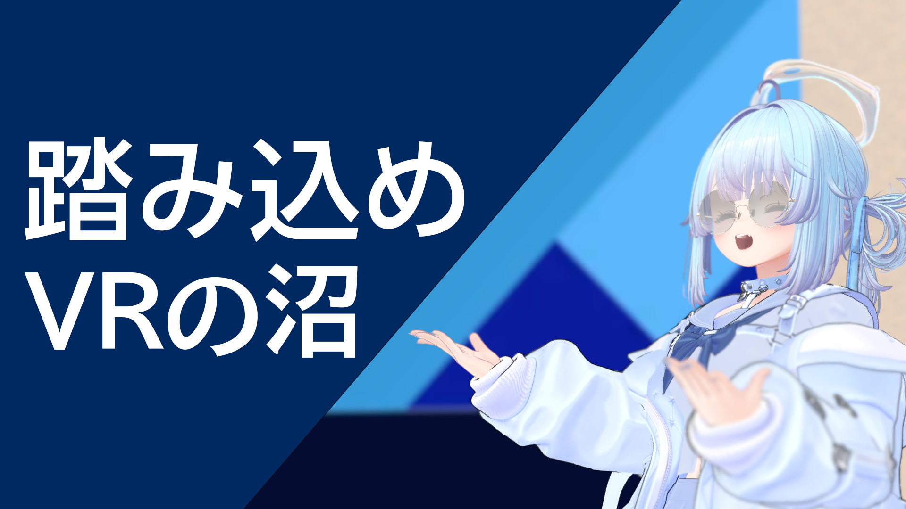
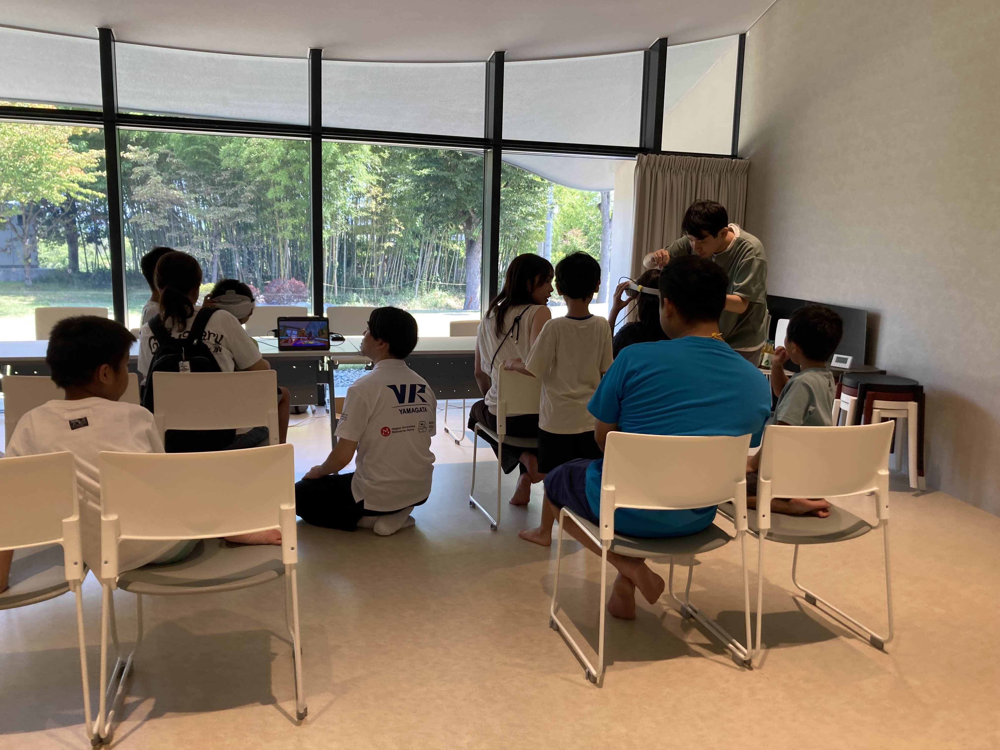
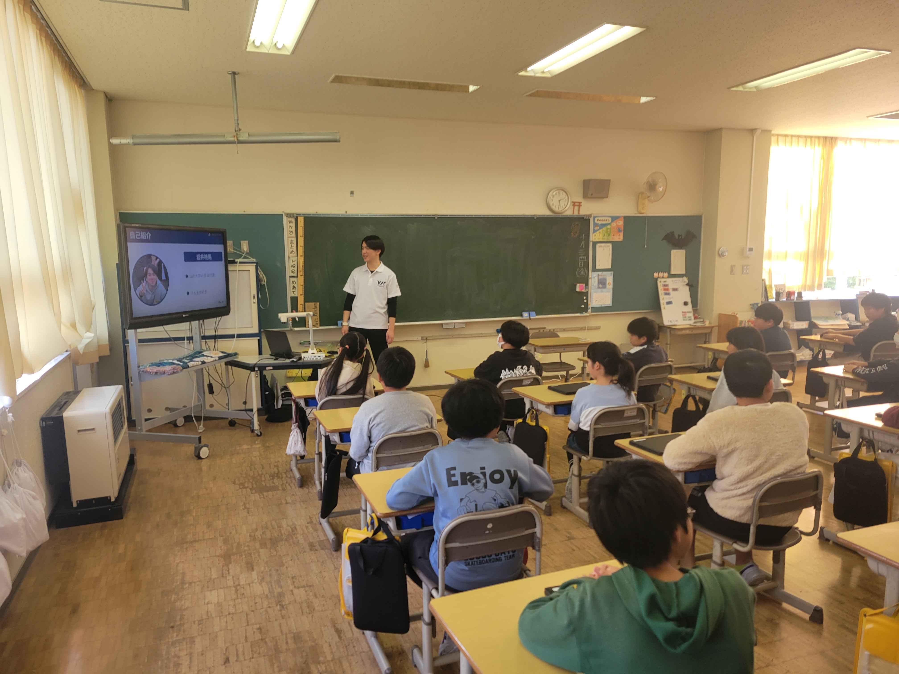
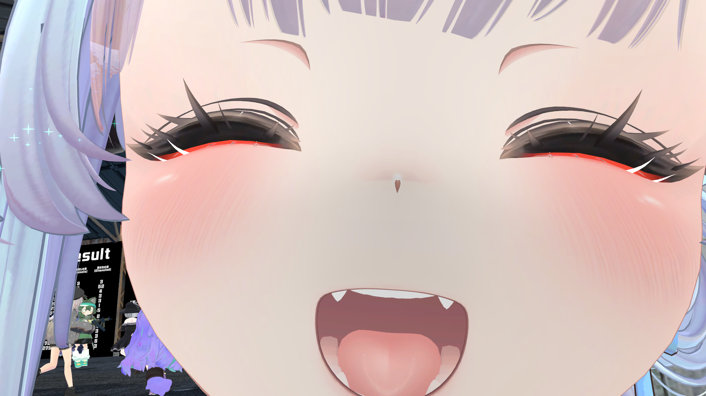

## 団体概要

山形大学VR部は、**2017年度に発足**した山形大学公認の学生XRコミュニティです。
現在は**約200名規模**の学生が所属し、VR / AR / MR を中心としたデジタル技術を用いて、**制作・体験・社会実装を横断する活動**を行っています。

単なる技術サークルにとどまらず、**行政・企業・地域と接続しながらXRを実社会で活用すること**を重視しており、地方（山形・東北）からXRの実践例を発信し続けています。

## 基本情報

| 項目   | 内容                            |
| ---- | ----------------------------- |
| 設立   | 2017年度                        |
| 所属   | 山形大学 公認サークル                   |
| 所属人数 | 約200名                         |
| 構成   | 学部生・大学院生             |
| 主な分野 | VR / AR / MR、Unity、メタバース、3D制作 |

## 地方XRコミュニティをけん引する存在へ

XR分野では、情報・人材・案件が都市部に集中しがちです。
山形大学VR部は、**地方においてもXRが「学べる・作れる・使われる」環境を成立させること**を目標に活動しています。

* 学生主体でありながら継続的に運営される大規模体制
* 分野横断的な人材が集まるプロジェクト型組織
* 学内外・地域と接続する実践重視の活動設計

これらを強みとし、**東北におけるXR人材・事例のハブ**となることを目指しています。

## 技術を地域へ還元するための活動

私たちは、XRを「専門家だけの技術」にせず、**地域や初学者にも開かれた形で普及させること**を重視しています。

* XR未経験者向けの体験機会創出
* 学内外イベントでのデモ・展示
* メタバースを活用した交流・実験的企画
* 学生同士の学びとノウハウの継承

「楽しさ」を入口とすることで、**XRに継続的に関わる人材の裾野を広げる**活動を行っています。

## 行政・企業と連携した実践的な取り組み

山形大学VR部では、**行政・企業・研究機関と連携した案件活動**を、正式な活動の一部として位置づけています。

### 対応可能な内容（例）

* XR体験会・展示イベントの企画運営
* 啓発・教育用途XRコンテンツの試作（PoC）
* 観光・地域資源をテーマとしたXR企画
* 大規模イベント・展示会への出展・運営協力

プロジェクト単位ではなく、**部全体で人員・知見を集約できる体制**を持つことで、学生団体でありながら一定規模の案件にも対応可能です。

**「地方でも、学生主体でも、XRは社会実装できる」**
その実例を、NUMAとともに積み重ねていきます。

## 連携・お問い合わせ

XR体験会、共同企画等のご相談を歓迎しています。
NUMA経由、または[山形大学VR部公式HP](https://virtual.yamagata.jp/)よりお気軽にご連絡ください。

## さいごに
来年度にむけて運営体制を一新しました

### **より一層魅力的なサークルを目指して**

著者：まーしゅ
